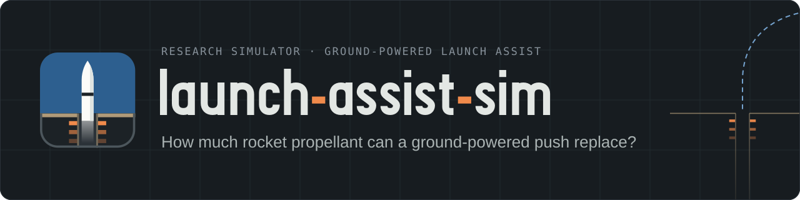

<picture>
  <source media="(prefers-color-scheme: light)" srcset="assets/brand/banner-light.svg">
  
</picture>

# launch-assist-sim

[](https://khoks.github.io/RocketLaunchOptimizationSimulator/)
[](docs/manual/README.md)
[](https://khoks.github.io/RocketLaunchOptimizationSimulator/deck/)
[](https://khoks.github.io/RocketLaunchOptimizationSimulator/examples/)
[](LICENSE)
[](https://github.com/khoks/RocketLaunchOptimizationSimulator/actions/workflows/pages.yml)

**Links:** [project site](https://khoks.github.io/RocketLaunchOptimizationSimulator/) · [user manual](docs/manual/README.md) ([on the site](https://khoks.github.io/RocketLaunchOptimizationSimulator/manual/)) · [slide deck](https://khoks.github.io/RocketLaunchOptimizationSimulator/deck/) · [animation examples](https://khoks.github.io/RocketLaunchOptimizationSimulator/examples/) · [findings](docs/findings/README.md) · [program board](docs/phases/README.md) · license: all rights reserved, public to read ([LICENSE](LICENSE); not open source)

A research simulator for giving rockets a ground-powered head start, and for finding out what that head start is really worth.

**Status:** Phases 0–2, SP1 and SP2 done. Work now runs as one phase per session; [`docs/phases/README.md`](docs/phases/README.md) is the program board. SP1 (closed 2026-10-04) answered the headline question of how much rocket propellant the silo push can replace at a fixed payload on the 2-D model, and added the launch settings it needs (silo depth with exit speed, and where the thrust ramp starts). Its preliminary finding, [`docs/findings/RQ1-fuel-offload-2d.md`](docs/findings/RQ1-fuel-offload-2d.md): on the gate vehicle model (which calibrates +14.3% high), sweep-optimized and unthrottled, the 3 g, 100 m cold-start silo lets the rocket leave out 41.26 t of stage-1 propellant at the pad's payload and orbit (10.04% of stage 1, 7.96% of the total; 36.01 t, 9.10% of stage 1, on the README-loads fork, which calibrates inside the band), before any structural mass for the 4 g push: an assumed +8.1 t of stage-1 structure leaves 1.98 t, and about 8.5 t (an extrapolation) cancels it. How much of it is the push itself is contested (read as the pre-registration worded it, most of the offload is the lighter stack's thrust-to-weight; in ideal delta-v, a reading chosen after the run, 28–29% is the lighter stack and the rest the push), the offloaded run's max-Q is 3.4% above the pad's, and the stage-2 case failed its verification. SP2 (closed 2026-10-07) added the local app, `launchsim app`: a launch form built from the committed experiments, a results panel, a run browser and the 2-D launch scene, which draws the pad and the silo side by side from a run's recorded time series, with an MP4 export; and `launchsim scene`, the same scene as a standalone page ([`docs/manual/07b-app.md`](docs/manual/07b-app.md); the recorded demo is [`docs/demos/SP2/`](docs/demos/SP2/README.md)). Every run launched from the app is **exploratory and never a finding**: it goes to `results/app/<timestamp>/` with that label and a banner, and findings come only from committed experiment files run from a clean tree. The app's launch of its `silo_cold_s1` preset reproduces SP1's 41.26 t within 0.002 kg (the same configuration on the same model: a reproduction, not new evidence). Next: SP7, the structural mass of the push load and a force-limited drive (taken out of roadmap Phase 3 and moved ahead of the 3-D work on 2026-10-04, because the structural cost decides whether the 10% survives; the order confirmed at SP2's close, decision D-SP2-40), then 3-D dynamics in three stages (a point mass on a rotating sphere, an oblate Earth, a 6-DOF fly-out; SP3–SP6, with the 3-D scene in SP4). The rest of roadmap Phase 3 (curved ramp, cable winch, air column and the other assist models) comes after that unless it is moved up. A new session starts from `docs/handoff/NEXT_SESSION.md`. The simulator has a 1-D vertical model, the constant-acceleration vertical silo push (concept A), and a 2-D rotating-Earth ascent to orbit with drag, guidance and payload search. The Falcon 9-class calibration missed high (+14.3%), and that miss is accepted and documented (`docs/findings/CAL-f9-leo-2d.md`). The first concept-A findings are preliminary; they are summarised under [Results so far](#results-so-far) and indexed in [`docs/findings/README.md`](docs/findings/README.md). `TODO.md` is the program-level tracker, and each phase's steps are in its file under `docs/phases/`. This README is the research brief; `CLAUDE.md` holds the build rules for Claude Code.

## Why this exists

Kerbal Space Program, OpenRocket and RocketPy all assume a rocket starts from a pad or a short launch rail. None of them can answer questions like these:

- What happens if a vertical maglev silo pushes the rocket out at 80 m/s before (or while) its engines light?
- What if a cable drive pulls the rocket along a track that curves from horizontal toward vertical?
- How much propellant does that save, how much payload does it add, what loads does it put on the rocket, and how much energy and peak power does the ground system need?

This project builds a simulator in which the launch-assist phase is a swappable model, and every result is compared against the same rocket launched normally.

## Quick start

> **Permission first.** The repository is public to read, but no license is granted ([LICENSE](LICENSE)). Cloning it and running the simulator on your own machine is a use the license does not cover, so ask the copyright holder for written permission first (through GitHub, `@khoks`). The steps below are for the author and for anyone who has that permission.

The full user manual is in [`docs/manual/`](docs/manual/README.md), and it is also on the [project site](https://khoks.github.io/RocketLaunchOptimizationSimulator/manual/): installing, running the shipped experiments, every experiment and vehicle key, every command and flag, the outputs and how to read them. This section is the short version.

`launchsim` is a command-line program whose outputs are files (Markdown, JSON, CSV and PNG), plus one local app. The `animate` command turns a finished 2-D run into a video, `replay` turns it into an interactive page you open in a browser, `scene` draws it as a launch scene (the pad and the silo side by side, from the recorded time series) on a standalone page, and `app` serves that scene with a launch form, a results panel and a run browser on `127.0.0.1` for this machine only. Every run launched from the app is exploratory and never a finding ([`docs/manual/07b-app.md`](docs/manual/07b-app.md)).

### Set up

Python 3.12 and [uv](https://docs.astral.sh/uv/):

```text
uv sync
```

Without uv, use a virtual environment and pip:

```text
python -m venv .venv
.venv\Scripts\Activate.ps1
pip install -e ".[dev]"
```

The second line is for Windows PowerShell. In Git Bash use `source .venv/Scripts/activate`; on Linux or macOS use `source .venv/bin/activate`.

ffmpeg is optional. It is needed only to write MP4 animations and the app's MP4 export; GIFs work without it, and the app runs without it with the export switched off.

### Test

```text
# fast tests
uv run pytest -q -m "not slow"
# all tests, including the slow tier
uv run pytest -q
# lint, then format
uv run ruff check .
uv run ruff format .
```

Windows PowerShell 5.1 has no `&&`, so run the two ruff commands separately (or chain them in Git Bash).

### Run an experiment

Each file in `experiments/` defines a pad baseline and its variants on one vehicle.

| Experiment | Model | What it runs |
|---|---|---|
| `silo_screening_1d.yaml` | vertical_1d | Concept A in 1-D: pad, nine variants, three sweeps |
| `silo_screening_2d.yaml` | planar_2d | Concept A to orbit: pad, nine variants, three sweeps, sensitivity cases |
| `silo_bridge_2d_readme.yaml` | planar_2d | pad, pad_instant, silo_instant and silo_cold on the README masses |
| `guidance_trigger_2d.yaml` | planar_2d | Kick-trigger fairness study (pad and silo_cold) |
| `calibration_f9_2d.yaml` | planar_2d | Calibration against the published Falcon 9 payload (labelled calibration) |
| `silo_offload_2d.yaml` | planar_2d | Propellant offload at fixed payload (SP1, pre-registered): pad, three silo variants, eleven offload cases, pad controls, sensitivity arms, five sweeps |
| `silo_offload_2d_readme.yaml` | planar_2d | The offload headline case repeated on the README masses (the calibration bridge) |

```text
uv run python -m launchsim run experiments/silo_screening_2d.yaml
uv run python -m launchsim sweep experiments/silo_screening_2d.yaml
```

`run` flies the baseline and every variant; `sweep` flies every sweep the file declares. Both take `--no-plots`, `--no-offload` (skip the offload block or the offload cases a sweep names) and `--results-root DIR`. Only `run` takes `--variant NAME` (only that variant, plus the baseline) and `--no-sensitivity` (skip the ±10% re-runs). A searched 2-D run takes about 7–10 s for the pad and 25–28 s for the lag variants (`TODO.md`, step 23), so a full experiment with its sensitivity cases takes minutes.

### What a results directory contains

Every run writes a new directory; nothing is overwritten.

```text
results/<experiment>/<UTC timestamp>/
├── summary.md            the report: every variant against the pad, losses, loads, energy, checks, assumptions
├── metrics.json          every number in the summary, machine-readable
├── resolved_config.yaml  the experiment as it ran, units converted to SI
├── plots/                PNG plots, <run>_<kind>.png (trajectory, speed, angles, losses, q_mach,
│                         felt_g, mass_thrust, track_forces, drive_power; altitude in 1-D)
└── <run>/
    ├── timeseries.csv    time, altitude, downrange, speeds, angles, mass, thrust, drag, q, Mach,
    │                     loss integrals, track forces and drive power
    └── events.csv        ignition, release, kick, staging, fairing, cutoff, ...
```

A sweep directory holds `baseline/`, one `sweep_<n>/run_<nnnn>/` directory per point (each with its own summary, metrics, CSVs and plots), a `sweep_<n>/sweep_index.csv` and a top-level `summary.md`. Only each run's top-level `summary.md` is tracked in git; the CSVs and plots stay local.

### Look at the results

- Start with `summary.md`. Its header gives the git hash and the comparison basis; its tables compare each variant with the pad, then list checks, flags and assumptions.
- `plots/` has one PNG per run and kind.
- The CSVs load straight into pandas or a spreadsheet: `pandas.read_csv("<run>/timeseries.csv")`.
- `uv run python -m launchsim app` opens the directory in the local app: pick it from the run list and watch the pad beside the silo in the 2-D launch scene, with the results panel and its caveats beside it; `Save video (MP4)` exports the scene as a video (ffmpeg). The app also launches new runs from a form; every one of them is exploratory, never a finding. Without the app, `launchsim scene <run_dir>` writes the same scene as a standalone page.

### The app and the scene

```text
uv run python -m launchsim app [--port N] [--results-root PATH] [--open]
uv run python -m launchsim scene <run_dir> [--runs NAME [NAME ...]] [--out PATH] [--display PATH]
```

- `app` serves `http://127.0.0.1:8765/` (this machine only; `--port 0` picks a free port) until Ctrl+C: a launch form built from the committed experiments with 17 presets, Launch (one at a time, cannot be cancelled), a progress card, a results panel that prints every caveat beside every number, a browser over the results directories on disk, the scene, and the MP4 export. A launch writes `results/app/<timestamp>/`, labelled `exploratory` with a banner in its `summary.md` and no PNG plots; the scene, the replay and every video frame of it carry the mark.
- `scene` writes `./<experiment>_<timestamp>_scene.html`, never inside `results/` (the one output-path rule of `animate`, `replay` and `scene`): the same page the app frames, playing from the file with no server. What it draws that the model does not compute (every shape, the held attitude when the engines are off, the spent stage's and fairing halves' drag-free coasts, the carriage after release, the tank levels) is named on the page as display-only; the vehicle's path, thrust and mass are replayed from the recorded time series, nothing is re-simulated.
- The manual's chapter [`docs/manual/07b-app.md`](docs/manual/07b-app.md) has the form group by group, the presets with their expected durations, the refusals, the scene's keys and the security notes; the recorded demo with screenshots in both themes is [`docs/demos/SP2/`](docs/demos/SP2/README.md); the recorded SP1 pair as a scene page and a video is example SP1.3 of the [animation gallery](https://khoks.github.io/RocketLaunchOptimizationSimulator/examples/).

### Animate a 2-D run

```text
uv run python -m launchsim animate <run_dir> [--runs NAME [NAME ...]] [--out PATH] [--fps N] [--seconds S] [--width PX]
```

- `<run_dir>` is one results directory of a `planar_2d` experiment (`results/<experiment>/<timestamp>`, with `<run>/timeseries.csv` and `<run>/events.csv`). 1-D (`vertical_1d`) runs are refused with a message.
- `--runs` picks the runs to show. The default is the baseline plus up to three variants, in summary order.
- `--out` picks the file, and its extension picks the format: `.mp4` through ffmpeg, `.gif` through Pillow. The default is `./<experiment>_<timestamp>_animation.mp4` in the current directory when ffmpeg is available, else `.gif`. The default path is never inside `results/`.
- `--fps` (default 30), `--seconds` (default 20, the length of the video) and `--width` (default 1280 px).

The capture in `docs/media/` comes from the shipped 2-D run:

```text
uv run python -m launchsim animate results/silo_screening_2d/20260930T175743Z --runs pad silo_cold --out docs/media/ascent_pad_vs_silo_cold_2d.mp4
```

`docs/media/ascent_pad_vs_silo_cold_2d.gif` is a smaller GIF of the same two runs, for embedding in this README (`--out docs/media/ascent_pad_vs_silo_cold_2d.gif --fps 12 --width 640`; GIF frame delays come in whole 10 ms steps, so 12 fps plays at 12.5 and the command prints the real rate). The video covers the first 30 s of flight slowly, so the silo push and liftoff are visible, and the rest of the ascent to orbit much faster; the current playback speed is shown in the corner. Rendering is not instant: about 4 minutes for the 600-frame 1280 px MP4 and under a minute for the GIF on a laptop. On a fresh clone the CSVs are not in git, so run the experiment first (`uv run python -m launchsim run experiments/silo_screening_2d.yaml --variant silo_cold --no-sensitivity` is enough for these two runs) and point `animate` at the new timestamped directory.

For an interactive view, `replay` writes a single HTML page you open in a browser: play, pause and scrub the flight, switch runs on and off, and read live telemetry, strip charts and each run's payload beside the caveats.

```bash
uv run python -m launchsim replay results/silo_screening_2d/20260930T175743Z --runs pad silo_cold
```

The default output is `./<experiment>_<timestamp>_replay.html`, never inside `results/` (one rule for `animate`, `replay` and `scene`: no output inside the run's results tree or any folder named `results`).

## The concepts

**A. Vertical maglev silo.** The rocket stands in an underground shaft lined with electromagnetic rings, which together form a vertical linear motor. The rings push either a carriage under the rocket or supports mounted on its body. Engines light inside the shaft (a hot launch, which needs exhaust ducting) or just after the rocket leaves it (a cold launch).

Body supports avoid a carriage that has to be braked, but they fly with the rocket. A carriage stays behind, but it sits in the exhaust if the engines are lit in the shaft.

```text
         ↑  release at the silo mouth (~50–100 m/s)
 ────────┬───────┬──────── ground
         │   ▲   │
         │  ███  │  rocket
         │  ███  │
         │  ███  │  EM rings line the shaft
         │  ═══  │  carriage (or supports on the body)
         │       │  stroke L, plus braking length for a carriage
         └───────┘
```

**B. Cable-pulled ramp.** A drive pulls a cable that runs over pulleys to a carriage holding the rocket. The track starts horizontal and curves up toward vertical, and the rocket is released at the top of the curve. The original idea used a train to pull the cable.

```text
                                  ↑ release, 80–90° above horizontal
                                 ╱
                               ╱   curved section of radius R
                             ╱     (about R tall if it ends vertical)
 ═══════════════════════════╯
 [carriage + rocket] → → → →   horizontal run
 cable ← pulleys ← drive (winch, flywheel, or train)
```

**C. Baseline.** The same rocket launched from a normal pad, with its own optimized ascent. Every result is a delta against C.

**Hypothesis.** Any ground-supplied velocity, however small, cuts the propellant the rocket needs, or raises its payload. The ground energy can come from renewables and be reused every launch.

## What first-order numbers say

These are hand calculations made to size the problem before the simulator was built. They are kept as written, except the EMALS energy comparison, which is corrected and marked. Where the simulator has since measured the same thing, a note marked **Simulation update** follows, with a link to the findings note it comes from.

### Exit speed

Exit speed is v = √(2aL), where a is the net acceleration along the track. A vertical silo must also supply 1 g just to hold the rocket's weight.

| Track length | 1 g | 3 g | 5 g |
|---|---|---|---|
| 10 m | 14 m/s | 24 m/s | 31 m/s |
| 50 m | 31 m/s | 54 m/s | 70 m/s |
| 100 m | 44 m/s | 77 m/s | 99 m/s |
| 300 m | 77 m/s | 133 m/s | 172 m/s |
| 1,000 m | 140 m/s | 243 m/s | 313 m/s |

For scale: reaching low Earth orbit takes roughly 9.4 km/s including losses. The U.S. Navy's EMALS catapult already accelerates a 45 t aircraft to about 67 m/s over 91 m (about 101 MJ of kinetic energy; *corrected*, see the peak-power row). At hobby scale, RocketPy's example high-power flights leave a 5.2 m rail at 26–45 m/s.

> **Simulation update** ([RQ3-1d](docs/findings/RQ3-silo-screening-1d.md)): the silo model reproduces √(2aL) exactly. At 3 g net over 100 m the rocket exits at 76.71 m/s after 2.607 s; the sweep gives 31.3, 44.3, 76.7, 99.0, 132.9 and 171.5 m/s at the table's points.

### Why small assists matter more than they look

Payload is a thin slice of liftoff mass, about 4% for a Falcon 9-class rocket, so every m/s saved gets multiplied. The estimate below uses the ideal rocket equation with a generic Falcon 9-class two-stage vehicle and holds all losses constant. It uses public propellant and upper-stage masses; the stage-1 dry mass (25.6 t) and average stage-1 Isp (295 s) are assumed, and the fairing is dropped at staging. The model totals 542.6 t against the published 549 t.

| Assist velocity | Payload gain | Or: stage-1 propellant saved at the same payload |
|---|---|---|
| 25 m/s | +220 kg (+1.0%) | — |
| 50 m/s | +440 kg (+1.9%) | — |
| 77 m/s (100 m at 3 g) | +690 kg (+3.0%) | 14 t (3.6%) |
| 99 m/s (100 m at 5 g) | +890 kg (+3.9%) | 18 t (4.6%) |
| 150 m/s | +1,360 kg (+6.0%) | — |
| 300 m/s | +2,790 kg (+12.2%) | 53 t (13.5%) |

That works out to about 9 kg of payload per m/s, so in the ideal case the hypothesis holds. (Carrying the fairing into stage-2 flight raises the 77 m/s gain to about +740 kg.)

> **Simulation update** ([RQ3-2d](docs/findings/RQ3-silo-screening-2d.md)): the 2-D model finds about twice this estimate, before any structural cost. The cold-start silo (3 g net, 100 m, 76.7 m/s) gains +1,498.8 kg on the gate vehicle, 1.96× the 765.4 kg yardstick at the pad's payload; on the README masses it gains +1,394.4 kg, 1.89× (derived) the 738.7 kg yardstick at that pad's payload. The reason is that a vertical release is not constant-loss: in silo_cold the gravity, steering, back-pressure, drag and fairing terms together fall by 74.1 m/s, and the pad pays 14.4 m/s for burning 2.7 t while clamped. The result is sweep-optimized and unthrottled, carries the +14.3% calibration miss, and charges no structural mass for the 4 g load; see [Results so far](#results-so-far).

> **Simulation update** ([RQ1-2d](docs/findings/RQ1-fuel-offload-2d.md)), for the "stage-1 propellant saved at the same payload" column: the 2-D model finds 2.5–2.8× the screening estimate, before any structural cost. At the pad's payload and orbit the cold-start silo (3 g net, 100 m, 76.7 m/s) leaves out 41.26 t of stage-1 propellant on the gate vehicle, 10.04% of its 410.9 t stage-1 load and 2.76× the 14.98 t ideal-screening offload at that release speed (the table's 14 t, 3.6%, is on the README masses); on the README masses it leaves out 36.01 t, 9.10%, 2.53× their 14.25 t. The reason is that the losses are not constant, and not only because of the release: the offloaded vehicle does without 228.2 m/s of ideal delta-v, of which only 76.7 m/s is the release speed. Of the other 151.5 m/s, 63–67 m/s (42–44%) is the lighter stack's own lower loss, which a fixed-loss screening also leaves out and which the pad would get too with the same smaller load (the pad so loaded still falls 1.4 t short of the payload); the rest is the head start's trajectory effects (69–74 m/s) and the pad's hold-down burn (14.4–15.6 m/s). These splits are derived by difference between runs and bracketed by the two orders of a two-step split. In the loss terms, 124.7 m/s is lower gravity and steering loss (roughly 53–56 m/s of it from the head start at equal stack mass and 68–72 m/s from the lighter stack), 14.4 m/s the pad's hold-down burn and 13.3 m/s back-pressure. The result is sweep-optimized and unthrottled, carries the +14.3% calibration miss, charges no structural mass for the 4 g load (an assumed 8.1 t of stage-1 strengthening leaves 1.98 t of it), and the offloaded run's max-Q is 3.4% above the pad's; see [Results so far](#results-so-far).

NASA's Magnetic Launch Assist papers cited "over 20%" onboard-fuel savings for an assist of roughly 270–280 m/s (600 mph, or 1,000 km/h), in the context of reusable and single-stage vehicles. A fixed vehicle can't get there on the rocket equation alone: a hydrogen-fueled single-stage vehicle saves only ~7% of its propellant at 275 m/s, and the table above gives 13.5% of stage-1 propellant at 300 m/s. The 20% figure probably assumes a vehicle resized around the assist. Treat it as a claim to explain, not a number to tune toward.

### What can eat the gain

The simulator's real job is to measure these penalties against the ideal numbers above.

| Penalty | First-order size | What it implies |
|---|---|---|
| Axial load on a full stack | A 3 g net vertical push means a fully fueled rocket feels 4 g. The interface carries 21.5 MN, 2.8× Falcon 9's liftoff thrust, and hydrostatic pressure at the tank bottoms rises ~2.8× over liftoff (1.4 g). Rockets normally see such g only near burnout, with nearly empty tanks. | Push gently, or strengthen stage 1 and count the mass. At 0.5 g net (1.5 g felt), 100 m gives only 31 m/s, and 77 m/s needs ~600 m of stroke. |
| Lighting engines after release | The rocket coasts against gravity until thrust builds: loss ≈ g × (delay + ramp/2) for a linear thrust ramp, or g × (delay + τ) for a first-order lag. That is 5–25 m/s for a 0–1 s delay and a 1–3 s ramp, up to a third of a 77 m/s assist. | Light the engines on the carriage, as MagLifter and Radian plan to. Then the exhaust hits whatever pushes the base. |
| Interface hardware on the rocket | 1 kg added to stage 1 costs ~0.13 kg of payload; 1 kg on stage 2 costs 1 kg. A 77 m/s assist breaks even at ~5.5 t extra on stage 1, or ~0.7 t on stage 2. | Keep magnets and supports on a ground carriage or stage 1, never on the upper stage. Strengthening stage 1 for a harder push comes out of the same ~5.5 t. |
| Curve geometry (B) | Curve radius R = v²/aₙ. At 77 m/s that is 600 m for 1 g of centripetal acceleration and 200 m for 3 g; at the start of the curve, gravity adds another 1 g of track load. A curve that ends vertical is a tower about R tall, and climbing it costs speed: at R = 200 m an unpowered carriage leaves the top at 44 m/s, and at R = 600 m it can't coast up at all. Exiting at 77 m/s from the 600 m curve takes ~3× the kinetic energy (~4.8 GJ for 549 t). | The drive has to keep pulling through the curve, as the original train-and-cable idea had it. Prior art used mountainsides (MagLifter) or wings (Radian). |
| Shallow release without wings | The flight path droops at g·cos γ / v: at 77 m/s, 5.2°/s at 45°, 3.7°/s at 60°, 1.3°/s at 80°. | Release near vertical. The release angle can replace the usual pitch-over maneuver. |
| Train traction (B) | Wheel-on-rail friction (coefficient ~0.35–0.5 in good conditions) caps a self-propelled train at a fraction of 1 g, and it has to accelerate its own mass as well as the rocket. | Use a stationary winch or flywheel drive, as launch coasters do, or a linear motor. The cable-and-pulley idea itself is sound. |
| Peak power | A 549 t rocket pushed 100 m vertically at 3 g takes ≈2.2 GJ in 2.6 s, peaking near 1.65 GW mechanical. That is ~1.2 MWh of electricity per launch at 50% efficiency. | Energy is cheap; power isn't. Store energy and discharge it fast (EMALS flywheels release up to 484 MJ in 2–3 s and recharge in 45 s), and trickle-charge from renewables. A 13 t small launcher at 77 m/s needs only ~38 MJ of kinetic energy. That is less than the ~101 MJ a 45 t aircraft carries at 67 m/s, and less than EMALS's rated 122 MJ per launch (about one of its four 121 MJ flywheel alternators). *Corrected: an earlier version said "less than one EMALS launch (122 MJ)"; 122 MJ is EMALS's rated energy, and 45 t at 67 m/s is ~101 MJ.* |
| Silo air (A) | A snug shaft acts like a piston: up to atmospheric pressure × bore area. A 3.7 m bore sees up to 1.1 MN, ~5% of a 21.5 MN drive force. A 140 mm hobby tube sees up to 1.6 kN, against ~0.2 kN of drive force for a 5 kg rocket. | Vent the shaft, or model the air column. |
| Carriage braking | At 77 m/s, a carriage braking at 5 g needs ~60 m. | The facility is longer than the stroke. |
| Failed ignition (A) | After a 77 m/s vertical exit, an unlit rocket coasts ~300 m up for ~7.8 s, then falls back into the silo. | Needs an abort mode; a slight tilt may help. |
| Sideways loads | A fueled rocket lying on a horizontal track, or turning through a curve, carries sideways loads along its whole length. Supports along the body concentrate loads at new points. | Report sideways loads from the start; do structural analysis later. |
| Aerodynamics | Extra speed low in the dense atmosphere raises drag loss and possibly peak dynamic pressure (max-Q). | Only a trajectory simulation answers this. |

**Simulation updates to the rows above.** These are measured values, except the "Silo air" row, which is an estimate and says so; the hand numbers in the table are kept as the first-order record. Every one is preliminary: concept A only, a prescribed-acceleration drive, and (in 2-D) sweep-optimized, unthrottled, on the gate vehicle that calibrates +14.3% high.

- **Axial load on a full stack** ([RQ3-1d](docs/findings/RQ3-silo-screening-1d.md), [RQ3-2d](docs/findings/RQ3-silo-screening-2d.md)). Measured: 3.999 g felt and 21.28 MN at the interface on the 542.57 t 1-D stack (the table's 21.5 MN uses 549 t and g0); 3.996 g and 22.49 MN on the 573.9 t 2-D stack. No structural mass is charged for this load, and about 8.1 t of silo-only strengthening would cancel the whole 2-D gain (a linear extrapolation, not a sized structure; see [Results so far](#results-so-far)).
- **Lighting engines after release** ([RQ2-1d](docs/findings/RQ2-ignition-timing-1d.md), [RQ2-2d](docs/findings/RQ2-ignition-timing-2d.md)). The 5–25 m/s band is the 1-D linear-ramp band (4.90–24.50 m/s by the formula). A first-order lag with τ = 1–3 s after the same 0–1 s delay gives 9.8–39.2 m/s in 1-D, because a lag of τ costs as much as a ramp of 2τ. In 2-D the loss is larger: on the README masses the 0.5 s delay + 2 s ramp costs 32.30 m/s (301.3 kg), 2.14× the 1-D 15.12 m/s.
- **Interface hardware on the rocket** ([RQ3-2d](docs/findings/RQ3-silo-screening-2d.md)). On the gate vehicle in 2-D, 1 kg on stage 1 costs about 0.18 kg of payload (184 kg per tonne), so the cold silo's break-even is about 8.1 t of extra stage-1 mass, not ~5.5 t.
- **Peak power** ([RQ3-1d](docs/findings/RQ3-silo-screening-1d.md), [RQ3-2d](docs/findings/RQ3-silo-screening-2d.md)). Measured: 2.128 GJ with a 1.632 GW peak in 1-D; 2.249 GJ with a 1.725 GW peak on the heavier 2-D stack.
- **Silo air** ([RQ3-2d](docs/findings/RQ3-silo-screening-2d.md)). Not measured: every run so far vents the shaft, with no shaft drag, and the air column is not modelled. The note's own estimate (from q = 3.6 kPa at the 76.7 m/s exit, C_D 0.46 and a drag growing with the stroke) is that the missing shaft drag biases drive energy, peak power and interface force low by about 0.04%, 0.08% and 0.08%, and leaves the release speed and the payload unchanged under the prescribed drive.
- **Carriage braking** ([RQ3-1d](docs/findings/RQ3-silo-screening-1d.md)). Braking at 5 g adds 60.0 m, so the 100 m stroke needs a 160 m facility. Braking is added to the length, not modelled as a phase (Phase 3).
- **Failed ignition** ([RQ3-1d](docs/findings/RQ3-silo-screening-1d.md), [RQ3-2d](docs/findings/RQ3-silo-screening-2d.md)). In 1-D the apex is 300.27 m at 7.829 s, and the stack is back at the mouth at 15.658 s. Unless the carriage is withdrawn within about 14.8 s, the stack first hits its own carriage, parked 60 m above the mouth (its braking distance), at 14.83 s and 68.6 m/s (1-D; not re-computed in 2-D). In 2-D the apex is 300.65 m at 7.843 s, and the stack is back at the mouth at 15.689 s at 76.60 m/s, only 0.4 m west of the axis. No abort is modelled.
- **Aerodynamics** ([RQ6](docs/findings/RQ6-aero-2d-preliminary.md)). Unthrottled max-Q falls 16.0%, q-alpha at the kick rises to 1.7–3.4× the pad's, and the drag loss falls 3.5 m/s.

## Results so far

Everything below is **preliminary**. It covers concept A only: a vertical silo whose drive imposes a prescribed acceleration. The 2-D results are sweep-optimized, not optimal-control. Each note in [`docs/findings/`](docs/findings/README.md) gives the full numbers, provenance and caveats; the numbers here are copied from those notes.


*The pad baseline and the cold-start silo (`silo_cold`: 3 g net over 100 m, released at 76.7 m/s, engines lit 0.5 s later with a 2 s ramp), both flown to a 200 km orbit. This is a replay of the recorded time series of `results/silo_screening_2d/20260930T175743Z`, rendered smaller from the same two runs as the MP4 (`launchsim animate --runs pad silo_cold`); the full-size MP4 is [`docs/media/ascent_pad_vs_silo_cold_2d.mp4`](docs/media/ascent_pad_vs_silo_cold_2d.mp4). Each run carries its own payload capacity (26,054.4 kg for the pad, 27,553.2 kg for the silo). Caveats: it is a point-mass planar model, sweep-optimized and unthrottled, and the kick has no angle-of-attack aerodynamics. It is the gate vehicle, which calibrates +14.3% high. No structural mass is charged for the silo's 4 g push, and the drive is prescribed-acceleration with a massless carriage and no shaft drag.*

### Calibration (labelled calibration, not validation)

From [CAL-f9-leo-2d](docs/findings/CAL-f9-leo-2d.md):

- Reference orbit: 200 km circular, 28.5°, due east, expendable. It was fixed before the run and never moved, and nothing was tuned toward the published 22,800 kg.
- The pre-registered gate vehicle (mass set C, `configs/vehicles/generic_f9_class_2d.yaml`) reaches **26,054.4 kg, +14.3% high**. That is 974.4 kg above the ±10% band's upper edge of 25,080 kg: a miss.
- Set A (the README masses) lands inside the band at 24,700.0 kg (+8.33%). Set B lands outside at 25,416.3 kg (+11.48%).
- Every numerical check passes. The cause of the miss is not established, because the omissions point both ways. Throttling, reserves and residuals would lower the payload; better guidance could raise it.
- On 2026-09-30 the user accepted the miss as documented. Every 2-D finding is on the gate vehicle and inherits it.

### 1-D (Phase 1, superseded for payload questions by 2-D)

- **Reference cold-start silo** ([RQ3-1d](docs/findings/RQ3-silo-screening-1d.md)): 3 g net, 100 m, engines lit 0.5 s after release with a 2 s ramp. It gains +69.64 m/s at stage-1 burnout over the pad. That is 76.71 m/s of exit speed, plus a 5.40 m/s hold-down credit, minus a 14.70 m/s ignition loss, plus a 2.23 m/s altitude term. Its ideal-screening equivalent is 621 kg, below the README's 685 kg, because the ignition loss outweighs the pad's hold-down waste.
- **Hot starts** ([RQ2-1d](docs/findings/RQ2-ignition-timing-1d.md)): under a prescribed acceleration they buy no exit speed. They trade 2.7–9.7 t of propellant (5.6–20.6 m/s at burnout, against the instant-thrust yardstick) for 0.47–0.85 GJ less drive energy and up to 40% less peak power. They get even that only if the exhaust misses the carriage.
- **Lag startups** ([RQ2-1d](docs/findings/RQ2-ignition-timing-1d.md)): a first-order lag costs twice a linear ramp of the same duration (a lag of τ equals a ramp of 2τ). For a 0–1 s delay and τ = 1–3 s the band is 9.8–39.2 m/s, against the README's 5–25 m/s ramp band. After a 0.5 s delay, τ = 1/2/3 s loses 15.12/25.20/35.28 m/s.
- **Loads** ([RQ3-1d](docs/findings/RQ3-silo-screening-1d.md)): the full 542.57 t stack feels 4.0 g during the push (21.28 MN at the interface), against 5.71 g on a nearly empty 146.87 t stage at burnout.

### 2-D to orbit (Phase 2)

Payload capacity P* to the reference orbit on the gate vehicle, all at 3 g net over 100 m (76.7 m/s release), from [RQ3-2d](docs/findings/RQ3-silo-screening-2d.md) and [RQ2-2d](docs/findings/RQ2-ignition-timing-2d.md):

| Run | Stage-1 start | P* | Gain over pad |
|---|---|---|---|
| pad (baseline) | lit at −2 s, 2 s ramp, held down | 26,054.4 kg | — |
| pad_instant (unphysical yardstick) | step to full thrust at release | 26,137.5 kg | +83.1 kg |
| silo_instant (unphysical yardstick) | step to full thrust at release | 27,880.4 kg | +1,826.0 kg |
| **silo_cold** (reference) | 0.5 s after release, 2 s ramp | 27,553.2 kg | **+1,498.8 kg (+5.75%)** |
| silo_hot_ramp_on_track | lit on the carriage, full thrust at release | 27,788.2 kg | +1,733.8 kg |
| silo_hot_full | full thrust for the whole push | 27,543.0 kg | +1,488.6 kg |

**For the hypothesis:**

- The cold-start silo gains **+1,498.8 kg** ([RQ3-2d](docs/findings/RQ3-silo-screening-2d.md)). Under every ±10% sensitivity case the gain stays between +1,345 and +1,667 kg. It is +1,526.8 kg with a doubled drag area, and +1,498.1 kg best-vs-best over the kick trigger.
- The gain is about 2.0× the README's ideal-screening estimate (765.4 kg at the pad's payload). The loss breakdown explains the beat, and nothing is left unexplained beyond search noise, so it is not treated as a bug. In the matched basis the gain splits into:
  - 46%: release speed at face value;
  - 34%: lower gravity and steering loss;
  - 9%: the pad's hold-down burn;
  - 8%: back-pressure;
  - 2%: drag.

  The capacity basis gives 51/27/10/9/2%.
- In the release anchor (silo_instant against pad_instant, both at full thrust from release), an early vertical m/s is worth about 22.7 kg of payload on this vehicle, 2.3× the screening's 10 kg. The cold start averages 19.54 kg per m/s at 76.7 m/s; its marginal value (the slope between sweep points) stays between 22.4 and 23.5 kg per m/s from 22 to 99 m/s.
- Lighting on the carriage, with the ramp ending at release, is the best physical variant: +235.0 kg over the cold start, paid for with 2.7 t burned on the track ([RQ2-2d](docs/findings/RQ2-ignition-timing-2d.md); no sensitivity run).
- Unthrottled max-Q falls 16.0% (31.24 against 37.19 kPa), and the drag loss falls 3.5 m/s ([RQ6](docs/findings/RQ6-aero-2d-preliminary.md)).

**Against the hypothesis, stated as plainly:**

- **Structural mass could cancel the gain.** No structural mass is charged for the 4.0 g full-stack load (22.5 MN at the interface). At about 184 kg of payload per tonne of stage-1 dry mass, about 8.1 t of silo-only strengthening would cancel the whole gain ([RQ3-2d](docs/findings/RQ3-silo-screening-2d.md)).
- **Part of the headline is not the push.** The pad's 2.7 t clamped ramp is a baseline convention, and it accounts for 130.7 kg gross (83.1 kg net). Against a pad lit at release, the gain is +1,415.8 kg.
- **The calibration miss inflates it.** On a vehicle calibrated to 22.8 t the gain would be expected near 1.3 t. That is derived by proportion, not run.
- **The startup after release is expensive.** The cold start gives back 327.1 kg (34.74 m/s) against an instant start, 18% of the instant start's gain, and 2.37× the 1-D formula. On the README masses it gives back 301.3 kg (32.30 m/s), 2.14× the 1-D ignition loss on the same masses. Every point of the gate-vehicle ignition sweeps costs 2.29–2.45× the 1-D formula. In payload terms the README's 5–25 m/s ramp band costs 112–545 kg on the gate vehicle. A 3 s lag after the same 0.5 s delay gives back 781 kg, 43% of the instant start's gain ([RQ2-2d](docs/findings/RQ2-ignition-timing-2d.md)).
- **A full hot start does not pay.** silo_hot_full is 10.2 kg behind the cold start, and −18.5 to +0.1 kg under the ±10% cases: a tie, not a gain.
- **The trajectory gain is unverified beyond the gravity-turn family.** At equal γ*, the cold start's in-air startup gives back the stage-1 gravity saving that the release buys, so silo_cold's trajectory gain (34% of the headline) appears only after MECO. It is the part a better (Phase 5) pad ascent could change, and optimal control could move it in either direction.
- **Small pushes gain little from the push itself.** At the slow corner of the sweep (0.5 g, 50 m, 22 m/s), the trajectory term is negative (−11.1 m/s). About 127 kg gross (about 83 kg net, 35%) of that point's +240 kg is the pad's hold-down burn, not the push.
- **One aerodynamic load gets worse.** q-alpha at the kick is above the pad's in every silo variant: 130–251 Pa rad at 77 m/s, up to 3,409 Pa rad at 172 m/s. The model charges no penalty for it ([RQ6](docs/findings/RQ6-aero-2d-preliminary.md)).
- **A failed ignition has no abort.** The full stack returns to the shaft mouth at 76.6 m/s after 15.7 s, 0.4 m from the axis.
- **The facility is sized by power.** The drive power rises to a 1.725 GW peak at release after a 2.6 s push. Each launch takes 2.249 GJ (1,249.5 kWh of electricity at an assumed 50%), and the facility is 160 m long (100 m stroke + 60 m braking at 5 g).

**Caveats that apply to every 2-D number:**

- Guidance is sweep-optimized, not optimal-control.
- Nothing is throttled, so max-Q and q-alpha are upper bounds.
- The kick is free: there is no angle-of-attack aerodynamics.
- The gate vehicle's +14.3% calibration miss carries into every number.
- No structural mass is charged for the 4 g full-stack load.
- The drive is prescribed-acceleration (`constant_accel`), with an unbounded drive force. A hot start therefore cannot add exit speed, and carriage mass and drive efficiency move only energy and power.
- The carriage has zero mass except in the 22 t sled variant.
- There is no air drag in the vented shaft.
- The model is a planar point mass with a generic C_D(Mach) table.

### Fuel replaced at fixed payload (SP1)

From [RQ1-fuel-offload-2d](docs/findings/RQ1-fuel-offload-2d.md) (pre-registered, run on 2026-10-03; same gate vehicle and caveats as above, plus partly filled tanks with the dry masses unchanged):

- **Headline.** At the pad's payload (26,054.4 kg to 200 km) the cold-start silo (3 g net, 100 m, 76.7 m/s) lets the vehicle leave out **41.26 t of stage-1 propellant: 10.04% of the stage-1 load, 7.96% of the total**. The pad itself can remove none (its stage-1 control finds 0), and the offloaded vehicle's own payload search returns the pad's payload to within 0.01 kg. Under the ±10% sensitivity arms it stays between 38.67 and 44.46 t. On the README masses, which calibrate inside the band, it is 36.01 t (9.10% of stage 1).
- **Why it beats the screening estimate (2.76× the 14.98 t ideal-screening offload).** The offloaded vehicle does without 228.2 m/s of ideal delta-v: release speed 76.7 m/s (34%), lower gravity and steering loss 124.7 m/s (55%), the pad's hold-down burn 14.4 m/s (6%), back-pressure 13.3 m/s (6%), drag −0.9 m/s. The breakdown closes to 5e-12 m/s, so the beat is explained, not a bug. The pad flown with the same offload falls 1,402 kg short of the payload. Read as the pre-registration worded it (that shortfall against the 41.26 t offload, 3.4%), its "most of the offload is the lighter stack" branch fired; the note reports that verdict, and argues that it compares payload kilograms with propellant kilograms. In ideal delta-v, a reading chosen after the run, 28–29% of the saved delta-v is the lighter stack's own thrust-to-weight gain and 71–72% the push at equal stack mass (the two orders of the two-step split bracket it). Both readings are in the note.
- **Structure can cancel it.** An assumed +2, +4 and +8.1 t of stage-1 dry mass leave 32.29, 22.88 and 1.98 t: each tonne takes 4.5–5.1 t off, and about 8.5 t (extrapolated) leaves nothing. No structural model exists yet.
- **Depth and ignition.** A cold start lit a fixed time after release leaves the mouth in the same state at a fixed exit speed whatever the drive, and no structural mass is charged for the push, so in this model the offload at a fixed exit speed is the same by construction: the same 76.7 m/s from 50 to 300 m of stroke gives 41.26 t within 0.07 kg, a check that the solver honours this, not a finding about depth. Depth at a fixed exit speed trades lower g and peak power for up to 71% more electricity and a longer facility; its lower felt g on the track (2.0 g at 300 m against 7.0 g at 50 m) would pay off only through a lighter structure, which no run charges. The exit speed alone does not set the offload: at the same 76.7 m/s, where the thrust ramp starts moves it from 26.7 t (lit 200 m up after release) to 47.0 t (lit 75 m deep on the carriage), 14.6 t below to 5.7 t above the headline. Over 25–300 m at 3 g the offload grows from 18.8 to 67.3 t, at a falling rate per m/s (300 m is an unconstrained-kick upper bound). Of the starts tried, lighting on the carriage 75 m deep removes the most (46.96 t), more than lighting at the shaft floor or at full thrust exactly at release; each second of ignition delay after release costs about 4.8–5.3 t. That ordering holds under the prescribed drive, where thrust on the track adds no exit speed and exhaust impingement moves no offload, and may change with a force- or power-limited drive (Phase 3). The hot starts' electricity and peak drive power are lower bounds (exhaust impingement 0, no plume model).
- **Loads and energy beside it.** The offloaded run's max-Q is 3.4% above the pad's (the full-load silo's was 16% below), its q-alpha 3.0× the pad's, and the stack feels 4.0 g on the track. The 12.4 t of RP-1 removed carry about 128× the push's 1.16 MWh of electricity in combustion heat, 5.65× with an assumed 8.1 t of stage-1 strengthening; that ratio of unlike quantities leaves out LOX production, fuel supply, grid losses and the facility, and is not an efficiency claim or a substitution rate.
- **Stage 2 and both stages are not the headline.** As pre-registered they are quoted net of the pad's own offload and labelled a property of the vehicle model's stage-2 sizing and guidance. The gross stage-2 removal, 31.90 t, failed its independent verification, so it is a flagged lower bound (by about 0.17 t, an estimate). Net of the pad's own 0.51 t, whose search carries its own flag (0.07–0.21 t), it is 31.39 t, uncertain by about 0.2 t either way. Why it is so large is unresolved: the pad finds stage-2 propellant nearly free over the first 0.5 t only, and the ascent is reshaped (steering loss 89.0 to 5.9 m/s). An equal-fraction offload of both stages removes 46.17 t in total. Stage 1 stays the only headline.

Research questions 4, 5, 7 and 8 have no findings yet; question 1 has a preliminary note on its fuel-replacement form only (above).

## Prior art

| Project | What it did | Status | Lesson |
|---|---|---|---|
| NASA Magnetic Launch Assist / MagLifter (1990s–2000s) | Horizontal maglev track about 1.5 miles long, 600 mph in 9.5 s. A superconducting-sled study put levitation modules at ~4% of liftoff weight, for vehicle-plus-sled masses up to ~600 t. | Technology demos only; systems like it were estimated to cost billions | The closest precedent; its claims are a benchmark to explain |
| EMALS, U.S. Navy (Ford-class carriers) | A 91 m linear motor launches a 45 t aircraft to 240 km/h. Four flywheel alternators store 121 MJ each, released in 2–3 s and recharged in 45 s. | Operational | Proves the ~100 m, ~2.5 g, ~70 m/s regime at 45 t |
| Holloman maglev sled, U.S. Air Force (2016) | A rocket-propelled, superconducting maglev sled reached 633 mph on a 2,100 ft track. | Test facility | Maglev works for sleds near Mach 1 |
| DARPA/NASA Horizontal Launch Study (2011) | Reviewed 130+ horizontal-launch studies spanning 60 years. | Only Pegasus ever became operational | Many concepts close on paper; cost decides |
| NASA KSC railgun launch assist (2011) | Argued a railgun could give a heavy vehicle 2–3 g for several seconds, beyond Mach 1. | Analysis and lab tests | Another drive option |
| Radian Aerospace | A rocket-powered rail sled, about 2 miles long, releases a winged spaceplane at Mach 0.7 with its engines already lit. | In development; subscale tests in 2024 | Wings make a shallow release workable |
| SpinLaunch | A 33 m vacuum centrifuge threw test vehicles at ~10,000 g in 10 flights (2021–22). | No orbital system built, as of 2025 reports | Kinetic launch suits only g-hardened payloads |
| Long March 11, China | A 58 t solid-fuel launcher cold-launched from a tube, igniting after ejection; 700 kg to low Earth orbit. | Operational | "Eject, then ignite" works at 58 t with solid motors |
| Intamin Accelerator Coasters (e.g., Kingda Ka, 2005–2024) | A hydraulic winch and cable pull a catch car: 0–206 km/h in 3.5 s, then a vertical climb up a 139 m tower. Kingda Ka's drive could deliver up to 15.5 MW. | Kingda Ka demolished in 2025 | Concept B at amusement-park scale, including rollbacks when speed falls short |

## Research questions

1. **Net benefit.** How does payload (or propellant) change with exit speed for each vehicle class, after interface mass, extra structure and ignition losses? Where is break-even?
2. **Hot or cold start.** Engines lit on the carriage versus after release: how sensitive are results to ignition delay and thrust ramp?
3. **Silo design.** Stroke versus the g a fully fueled stack can take (or the extra structure it would need), venting, carriage braking, and a failed-ignition abort (vertical versus slightly tilted exit).
4. **Ramp design.** Release angle versus payload; curve radius versus sideways load versus tower height. Is near-vertical release mandatory without wings?
5. **Drive and energy.** Linear motor versus cable winch (versus counterweight); cable dynamics; efficiency; energy-storage size; renewable charging at a given launch cadence.
6. **Aerodynamics.** How do drag loss and max-Q change when the rocket starts fast, low in the atmosphere?
7. **Vehicle redesign.** A Falcon 9 lifts off at a thrust-to-weight ratio near 1.4. With an assist, can stage 1 carry smaller or fewer engines, and what is that worth?
8. **Scale.** Hobby rocket, small launcher (~13–60 t), medium launcher (~550 t): where does the idea pay off, and where does existing EMALS-class hardware already suffice?

Preliminary notes exist for questions 1, 2, 3 and 6 (concept A only; question 1 in its fuel-replacement form); [`docs/findings/README.md`](docs/findings/README.md) indexes them.

## The simulator at a glance

- **Phases:** hold → assist (1-DOF motion along a track) → release → ignition (step, linear ramp or first-order lag) → ascent → staging (and fairing jettison) → orbit insertion. The ascent is either 1-D vertical (`vertical_1d`) or 2-D planar (`planar_2d`): spherical rotating Earth, standard atmosphere, drag varying with Mach, back-pressure, a vertical rise and kick, a gravity turn on stage 1 and linear-tangent steering on stage 2, with payload capacity found by bisection.
- **Assist models built now:** none (pad), and constant acceleration (`constant_accel`, screening) on a straight track, used so far as a vertical silo. The drive force is whatever the prescribed acceleration needs, with no force or power limit.
- **Assist models planned for Phase 3:** linear motor (force- and power-limited), curved track geometry, cable winch (elastic cable, drum inertia, pulleys), the silo air column, friction, modelled carriage braking, release at a target speed, and a tilted-exit abort.
- **Outputs for every run:** payload or propellant margin versus baseline; gravity, drag, steering and back-pressure losses; max-Q; peak felt axial and sideways g, and the interface force; assist energy, peak power and facility length. They come as `summary.md`, `metrics.json`, CSV time series and PNG plots; `launchsim animate` turns a 2-D run into an MP4 or GIF, `replay` into an interactive page, `scene` into a launch scene page, and the local app (`launchsim app`) shows the scene beside the results panel and exports it as an MP4 ([Quick start](#quick-start)).
- **Validation first:** every physics piece gets an analytic test before any experiment is trusted. The list lives in `CLAUDE.md`; every test it requires for Phases 0–2 passes.

## What you need to start

### Knowledge, in the order you'll need it

1. The rocket equation, staging, Δv budgets and loss terms. Sutton & Biblarz, *Rocket Propulsion Elements*; Curtis, *Orbital Mechanics for Engineering Students* (its rocket-dynamics chapter covers the gravity turn).
2. Numerical integration of ODEs with events (SciPy `solve_ivp`): tolerances, event detection, convergence checks.
3. Atmospheric flight: standard atmosphere, drag versus Mach, dynamic pressure. Anderson, *Introduction to Flight*.
4. Orbit basics: circular velocity, vis-viva, the boost from Earth's rotation. Bate, Mueller & White, *Fundamentals of Astrodynamics*.
5. Ascent guidance, then optimal control for fair comparisons: gravity turn, then linear-tangent steering, then direct collocation (Dymos/OpenMDAO or CasADi).
6. Linear motors and pulsed power at the black-box level: force–speed curves, efficiency, and flywheel, capacitor and battery storage. The EMALS literature is a good start.
7. Load paths: axial versus sideways loads, why rocket tanks are pressure-stabilized, how hardpoints add mass.
8. Cables and pulleys (concept B): cable stretch, oscillation, drum inertia, sheave friction.

### Software

Python 3.12 managed with uv; numpy, scipy, pandas and matplotlib; PyYAML and pydantic for configs; pytest, ruff and Pillow (the dev extra; Pillow also comes with matplotlib); `ambiance` for the ICAO standard atmosphere (valid to about 81 km); RocketPy for 6-DOF hobby-scale comparisons; later, Dymos/OpenMDAO or CasADi for trajectory optimization; JupyterLab for exploration. Git, with the repository public on GitHub at [khoks/RocketLaunchOptimizationSimulator](https://github.com/khoks/RocketLaunchOptimizationSimulator) (public to read, all rights reserved; see [License](#license)). Its [GitHub Pages site](https://khoks.github.io/RocketLaunchOptimizationSimulator/) is built from `site/`, `assets/brand/` and `docs/manual/` by `site/build.py`, which `.github/workflows/pages.yml` runs and deploys on every push to `main`. The build uses Python-Markdown, installed only in CI and for local previews (`uvx --with markdown==3.11 python site/build.py`); it is not a project dependency.

### Data

- Public vehicle numbers (Falcon 9, Electron, Long March 11). Each value in a vehicle file names its source, and anything estimated is marked as assumed.
- A generic drag-versus-Mach curve for slender launchers to start with; RocketPy or OpenRocket curves at hobby scale.
- For the hobby-scale case, a real rocket's measured mass, center of gravity and motor thrust curve (a Level 1 build works well).
- EMALS and launch-coaster figures to sanity-check drive sizing.

### Compute

A laptop. A single ascent simulation takes seconds at most, thousand-run sweeps take minutes, and trajectory optimization takes minutes to hours. (Measured so far: a 2-D run with its payload and guidance search takes about 7–10 s for the pad and 25–28 s for the lag variants; `TODO.md`, step 23.)

### Safety

This is a simulation project. Before building any physical assist device at hobby scale, talk to your club's range safety officer: it isn't a standard launcher and may not be allowed at club launches. Amateur rocket flights in the U.S. also fall under FAA rules (14 CFR Part 101).

## Roadmap

| Phase | Deliverable | Done when | Status |
|---|---|---|---|
| 0. Scaffold | Package, constants, atmosphere wrapper, CLI stub, test harness | Tests pass and the commands in `CLAUDE.md` work | Done |
| 1. Vertical 1-D | Rocket equation, gravity and staging in one dimension | Rocket-equation, gravity-loss and coast-apex tests pass | Done (plus the constant-acceleration vertical silo push) |
| 2. Ascent to orbit | Spherical rotating Earth, drag, thrust versus ambient pressure, gravity turn, loss budget, payload search | Orbit, loss-budget and convergence tests pass; the generic Falcon 9-class vehicle lands within ±10% of 22.8 t to low Earth orbit at a stated reference altitude | Done, with the calibration miss noted: the tests pass, but the gate vehicle lands +14.3% high (26,054.4 kg to 200 km), outside the band. The user accepted it as a documented miss ([CAL-f9-leo-2d](docs/findings/CAL-f9-leo-2d.md)) |
| 3. Assist models | Constant acceleration, linear motor, track geometry (vertical, straight, curved), cable winch, ignition timing; the structural mass for the 4 g full-stack push (added with the plan of 2026-09-30) | Track, ramp-energy, release-mapping, energy-balance and cable tests pass | Structural-mass part scheduled: the structural mass for the 4 g push, with a force-limited drive, is phase SP7, the next phase (after SP2, closed 2026-10-07) and before the 3-D phases (decisions D-SP1-18, 2026-10-04, and D-SP2-40, 2026-10-07). The rest is planned after SP1–SP7 unless moved up (see [`docs/phases/README.md`](docs/phases/README.md)); constant acceleration, the straight track, ignition timing and the release mapping already exist |
| 4. Experiments | Sweeps for research questions 1–8 | Each question has a write-up in `docs/findings/` with plots and caveats | Planned (preliminary concept-A notes for RQ1, RQ2, RQ3 and RQ6 exist) |
| 5. Fair comparison | Optimized ascent for each configuration (Dymos or CasADi) | Headline results re-run with optimized guidance | Planned |
| 6. Hobby scale in 6-DOF | RocketPy model of a real rocket with an assist before the rail | Baseline apogee matches RocketPy within ±5%, and the assist's effect is quantified | Planned |

## Repository layout

`CLAUDE.md` has the annotated version.

```text
launch-assist-sim/
├── README.md
├── CLAUDE.md
├── LICENSE                   all rights reserved: public to read, no license granted
├── TODO.md                   program-level tracker: milestones, priorities, backlog, decisions
│                             log, known issues
├── pyproject.toml
├── src/launchsim/            physics, models, simulation, CLI (run, sweep, animate, replay, scene, app),
│                             the local app and the scene with their page templates
├── configs/vehicles/         vehicle definitions with sources
├── experiments/              one YAML file per experiment
├── results/                  generated output, never hand-edited; only each run's
│                             top-level summary.md is tracked in git
├── docs/physics.md           equations and assumptions
├── docs/manual/              user manual: README.md (contents) and chapters 01-12 (with 05b and 07b);
│                             the source of the manual pages on the project site
├── docs/findings/            one write-up per research question, plus the calibration record;
│   │                         README.md indexes them
│   └── probes/               labelled probes cited by the notes (not shipped runs)
├── docs/media/               animations captured with `launchsim animate`
├── docs/process/             SESSION_PROTOCOL.md: how every session runs
├── docs/phases/              program board (README.md), one file per phase (SP1 to SP7, in the
│                             planned order SP1, SP2, SP7, SP3 to SP6), inputs/ (the approved
│                             plan, designs, code surveys)
├── docs/handoff/             NEXT_SESSION.md (read first by a new session), archive/
├── docs/demos/               recorded demo of each finished phase (SP1/, SP2/: a README with the
│                             commit and the commands, screenshots, console and API records)
├── assets/brand/             logo, mark, favicon, banner and social preview (SVG and PNG);
│                             build_brand.py and render_png.py regenerate them
├── site/                     GitHub Pages source: landing page, slide deck (deck/), animation
│                             gallery (examples/), shared CSS and JS, the page templates
│                             (manual, replay frame), and build.py, which builds everything
│                             into _site/ (gitignored)
├── .github/workflows/        pages.yml: builds the site and deploys it to GitHub Pages on
│                             every push to main
├── notebooks/                exploration only
└── tests/
```

## Working with Claude on this

- Build in the Code tab with this folder open, starting each phase in Plan mode. Use Opus 5.5 at high effort for implementation, and Fable 5.1 (or Opus 5.5 at xhigh) for physics design and for debugging results that look wrong.
- Do literature digging and physics Q&A in Chat, then save conclusions to `docs/findings/` so Code sessions see them.
- One fresh session per phase, following `docs/process/SESSION_PROTOCOL.md`: a session starts from `docs/handoff/NEXT_SESSION.md`, completes and tests one phase from `docs/phases/`, and prepares the next session's documents and prompt.

## References

- NASA Magnetic Launch Assist overview (science.gov): https://www.science.gov/topicpages/m/magnetic+launch+assist
- NASA MSFC maglev launch-assist paper (NTRS 20000103883): https://ntrs.nasa.gov/api/citations/20000103883/downloads/20000103883.pdf
- Hybrid chemical–electrical launch assist, MagLifter SSTO context (NTRS 20090034160): https://ntrs.nasa.gov/api/citations/20090034160/downloads/20090034160.pdf
- Magnetic Launch Assist, NASA's vision for the future: https://www.researchgate.net/publication/3102084_Magnetic_Launch_Assist_-_NASA's_vision_for_the_future
- Superconducting magnets for Maglifter launch-assist sleds: https://www.researchgate.net/publication/3311683_Superconducting_magnets_for_Maglifter_launch_assist_sleds
- Report of the DARPA/NASA Horizontal Launch Study (NTRS 20110015353): https://ntrs.nasa.gov/citations/20110015353
- Near-term horizontal launch results (NTRS 20130000446): https://ntrs.nasa.gov/archive/nasa/casi.ntrs.nasa.gov/20130000446.pdf
- The Feasibility of Railgun Horizontal-Launch Assist (NTRS 20110005535): https://ntrs.nasa.gov/citations/20110005535
- Electromagnetic Aircraft Launch System: https://en.wikipedia.org/wiki/Electromagnetic_Aircraft_Launch_System
- Holloman maglev sled record: https://www.airandspaceforces.com/breaking-the-maglev-record-again/
- Radian Aerospace: https://payloadspace.com/radian-aerospace-deep-dive/ and https://spacenews.com/radian-aerospace-begins-tests-of-spaceplane-prototype/
- SpinLaunch: https://www.space.com/spinlaunch-aces-10th-suborbital-test-launch and https://thespacebucket.com/spinlaunch-is-still-trying-to-make-an-orbital-accelerator/
- Long March 11: https://en.wikipedia.org/wiki/Long_March_11
- Accelerator Coaster launch system: https://en.wikipedia.org/wiki/Accelerator_Coaster
- Kingda Ka: https://en.wikipedia.org/wiki/Kingda_Ka
- Wheel–rail adhesion: https://en.wikipedia.org/wiki/Adhesion_railway
- Falcon 9: https://www.spacex.com/vehicles/falcon-9 and https://en.wikipedia.org/wiki/Falcon_9_Block_5
- Electron: https://en.wikipedia.org/wiki/Rocket_Lab_Electron
- RocketPy: https://github.com/RocketPy-Team/RocketPy and https://docs.rocketpy.org/
- ambiance (ICAO standard atmosphere): https://github.com/airinnova/ambiance
- Dymos: https://openmdao.github.io/dymos/

## License

Copyright (c) 2026 Rahul Singh Khokhar. **All rights reserved.** The repository is public so that it can be read; no license is granted, and it is not open source. You may not copy, modify, merge, publish, distribute, sell or otherwise use any part of it (code, documentation, findings, images, animations or slides), commercially or otherwise, without written permission. GitHub's terms let other users view and fork it on GitHub; that is the only use permitted. The research ideas are disclosed for reading and discussion, and publishing them grants no right to implement or commercialise them; earlier launch-assist work is credited under [Prior art](#prior-art). See [LICENSE](LICENSE) for the full text.
