# CAL: Falcon 9-class payload to LEO, planar 2-D model (calibration record)

> **CALIBRATION, not validation.** This note compares the model's payload capacity with a published figure (22,800 kg to LEO, expendable, spacex.com) as a benchmark, never a target. No parameter was tuned toward it; the run's inputs were frozen and committed before it ran. A miss, high or low, is reported as it is, with the same checklist as a pass (CLAUDE.md, plan decision 1).

## Result in one paragraph

The pre-registered gate vehicle (mass set C) reaches **P* = 26,054.4 kg** (sweep-optimized), **+14.27%** against 22,800 kg. That is **outside** the 20,520-25,080 kg band: a **miss high by 974.4 kg** above the upper edge (about 111 m/s of delta-v margin at the local slope of 8.80 kg per m/s at P*, from the search's final verification at P* +/- 20 kg). Set A (README loads) lands inside at 24,700.0 kg (+8.33%); set B (recorded scope) lands outside at 25,416.3 kg (+11.48%). Every run passes every numerical check (closure, identity, orbit, search). Milestone M7 is therefore **[!]**: the run is stopped for the user's decision. No physics and no tuning have been added after the fact.

## Provenance

- Run directory: `results/calibration_f9_2d/20260930T100100Z/` (summary.md, metrics.json, per-run events and time series, plots). Timestamp 20260930T100100Z, git c2849b72e01d (dirty: false).
- Pre-registered inputs: configs/ and experiments/ clean at commit **c2849b72e01d** (summary.md; metrics.json `preregistration`: dirty false, no dirty paths). The gate (set C) was frozen in that commit, before the run.
- Command: `uv run python -m launchsim run experiments/calibration_f9_2d.yaml` (run by the orchestrator from the clean tree).
- Search budget id: `a17a01601d0f4ae0c48cac48342127d5597e056e769da83503d7364c7d65a7df` (shared by every run).
- Model: planar_2d (rotating spherical Earth, point-mass mu/r^2 gravity, ICAO atmosphere with an isothermal extension above 81 km, drag, back-pressure, unthrottled). Guidance is sweep-optimized, not an optimal-control solution (Phase 5).

## Pre-registration (frozen before the run)

- **Reference orbit** (decision 2): 200 km circular above the R_E sphere (r_t = 6,578,137 m), inclination 28.5 deg, due east (azimuth 90 deg) from 28.5 N, expendable. SpaceX does not publish the reference altitude; this one is fixed and never moved. 185, 250 and 300 km are context cases only.
- **Gate**: mass set C (`configs/vehicles/generic_f9_class_2d.yaml`), chosen on provenance (best launch-mass closure) while the prototype suggested it misses high. In the table below set B's closure (549.90 t) is numerically nearer the published 549 t than set C's (546.30 t), but only because B mixes the README's assumed 25.6 t stage-1 dry mass with the FT propellant loads; set C's advantage is that all its masses come from one source table. The pre-registered choice stands.
- **Measured on the gate fork before the freeze** (build steps 21-25, docs/physics.md): at a fixed 22.8 t the gate fork kept m_res = 3,135.7 kg at gamma* 20 deg ("Measured on the gate fork") and 3,242.7 kg at 22 deg (the direct-root boundary scan). So the direction and rough size of a miss high were known when the inputs were frozen. The three vehicle forks and `experiments/calibration_f9_2d.yaml` were first committed in the freeze commit itself (c2849b7, together with build steps 15-25), so git history cannot show them untouched after those measurements. Their values equal plan section 7 and amendment 2 value for value (checked in the step-26 review), and no input was changed in response.
- **Fixed inputs** (decision 3): A_ref 10.52 m^2 (3.66 m body, Braeunig convention; 21.24 m^2 fairing section as a bound case); Braeunig ballpark C_D(Mach) table (23 knots, PCHIP, cd_scale 1, assumed, not Falcon 9); fairing jettison when 0.5 rho |v_rel|^3 < 1,135 W/m^2 (User's Guide 2021 p.38); MECO-to-SES-1 coast 11 s (User's Guide Table 8-4); stage-1 9 x 914.1 kN vac / 845.2 kN SL, Isp_vac 311 s, 2 s ramp lit at -2 s under hold-down; MVac 981 kN, 348 s, step start, A_e 8.6 m^2 (assumed); no throttle, no flight-performance reserve, no unusable residuals, payload adapter counted as payload.
- **Fitted or solved outputs** (guidance only): gamma*_MECO (Earth-relative flight-path angle at MECO; grid 8-36 deg step 2, refined by bounded Brent), the kick angle delta (solved for gamma*), the LTG pair (a, b) (solved by shooting), and P* (bisection to zero residual at insertion).
- **Selected with prototype knowledge** (decision 5, decisions log): the kick trigger v_k = 50 m/s and the kick law (vertical rise, hold-to-alignment kick, gravity turn along v_rel). The trigger study of step 27 reports best-vs-best dP*; this note does not re-tune them.
- **Forbidden on a miss**: tuning, new physics, moving the orbit or the gate.

Mass sets (stage-1 dry / propellant, stage-2 dry / propellant, fairing, t) and the launch-mass closure (liftoff mass without payload, from metrics.json) against the published 549 t. Engines and every other input are identical across the three. Set C mixes FT masses with Block 5 thrust (disclosed; the same source table gives 934 kN for the FT upper stage).

| set | masses [t] | launch mass without payload [t] |
|---|---|---|
| A: README | 25.6 / 395.7 / 3.9 / 92.67 / 1.9 | 519.77 |
| B: recorded re-sourcing scope | 25.6 / 410.9 / 4.0 / 107.5 / 1.9 | 549.90 |
| C: full FT table (gate) | 22.2 / 410.9 / 4.0 / 107.5 / 1.7 | 546.30 |

### Prototype disclosure (plan decision 1; indicative, inputs differed)

| set | prototype during planning | this run |
|---|---|---|
| A | about 25,082 kg at v_k 46 m/s (+10.01%, 2 kg above the band) | 24,700.0 kg (+8.33%) |
| B | not prototyped | 25,416.3 kg (+11.48%) |
| C (gate) | roughly +10 to +14% | 26,054.4 kg (+14.27%) |

The prototypes used other inputs (for set A, v_k 46 m/s; plan decision 1), so the differences are not a measurement of anything. Set C lands just above the top of its disclosed range (+14.27% against roughly +10 to +14%).

## Results: the three mass sets (equal prominence)

| set | run | P* [kg] (sweep-optimized) | vs 22.8 t | band 20,520-25,080 kg | residual at 22.8 t [kg] | dv margin at 22.8 t [m/s] |
|---|---|---|---|---|---|---|
| A (README) | `readme_loads` | 24,700.0 | +8.33% | inside (380.0 kg below the upper edge, 4,180.0 kg above the lower) | 1,814.4 | 224.4 |
| B (recorded scope) | `recorded_scope` | 25,416.3 | +11.48% | outside, 336.3 kg above the upper edge | 2,597.8 | 315.7 |
| C (gate) | `pad` | 26,054.4 | +14.27% | outside, 974.4 kg above the upper edge | 3,235.4 | 389.0 |

### Gate verdict (pre-registered gate: set C)

**Miss high.** P* = 26,054.4 kg is +14.27% against 22,800 kg and 974.4 kg above the band's upper edge of 25,080 kg (4.27 percentage points beyond +10%). At 22,800 kg the gate vehicle still carries 3,235.4 kg of stage-2 propellant (389.0 m/s of delta-v margin). M7 is **[!]**; the run is stopped for the user's decision. Nothing below changes that verdict.

### Cases (independent runs, never compared as results)

| case | what changes (gate vehicle otherwise) | P* [kg] (sweep-optimized) | vs 22.8 t | band |
|---|---|---|---|---|
| `aref_fairing` | A_ref 21.24 m^2 (5.2 m fairing section): the drag bound | 25,663.5 | +12.56% | outside, 583.5 kg above the upper edge |
| `alt_185` | 185 km circular (context) | 26,290.6 | +15.31% | outside, 1,210.6 kg above the upper edge |
| `alt_250` | 250 km circular (context) | 25,188.9 | +10.48% | outside, 108.9 kg above the upper edge |
| `alt_300` | 300 km circular (context) | 24,214.4 | +6.20% | inside (865.6 kg below the upper edge, 3,694.4 kg above the lower) |
| `no_rotation` | Earth rotation off (diagnostic of the rotation credit) | 22,130.0 | -2.94% | inside (2,950.0 kg below the upper edge, 1,610.0 kg above the lower) |

- **A_ref bound**: doubling the reference area (drag loss 51.9 m/s against 26.0 m/s) costs 390.9 kg; the bound case is still 583.5 kg above the band. The drag assumption cannot carry the miss.
- **Altitude**: P* falls 236.2 kg from 185 to 200 km, 865.5 kg from 200 to 250 km and 974.5 kg from 250 to 300 km. 185 km is further above the band; 300 km lands inside (+6.20%). The altitude is pre-registered and is not moved; these are context only.
- **No rotation**: 22,130.0 kg, 3,924.4 kg below the gate pad. The Earth-relative speed to reach is omega_p r_t = 421.6 m/s higher; J_vac rises by 432.8 m/s (Earth-relative losses +11.3 m/s). In inertial terms the same 432.8 m/s is the pad's 408.7 m/s rotation speed (plan section 11's rotation row, 408.74 m/s) plus 24.1 m/s of lower inertial total loss with rotation (1,657.3 against 1,681.4 m/s). 3,924.4 kg over 432.8 m/s is a secant of 9.07 kg of P* per m/s of J_vac; the ideal rocket-equation slope dP/dJ_vac at fixed stage masses (own arithmetic from the pad's stage masses) is about 9.8 kg per m/s at 26.05 t and about 8.4 at 22.13 t, and the secant lies between them, so the no-rotation delta is what the rocket equation predicts. (The 8.80 kg per m/s used elsewhere is a different slope: P* per m/s of stage-2 delta-v margin.) A diagnostic of the rotation credit, not quoted in advance and not a result.

## Fitted outputs per run

gamma* is the Earth-relative flight-path angle at MECO, reported to an effective 0.1 deg (amendment 3); delta is the kick angle from local vertical; tan(pitch) = a - b tau in stage 2 (local horizontal, tau from stage-2 ignition). The kick starts when |v_rel| reaches 50 m/s in every run (regime after_vertical_rise).

| run | gamma* [deg] | grid best [deg] | delta [deg] | LTG a | LTG b [1/s] | kick at t [s] | kick duration [s] | refine gain P2 - P1 [kg] |
|---|---|---|---|---|---|---|---|---|
| pad (set C, gate) | 23.0 | 22 | 2.83 | 0.6102 | 1.5608e-03 | 12.49 | 5.28 | 18.4 |
| readme_loads (set A) | 20.9 | 20 | 4.00 | 0.5318 | 1.7502e-03 | 10.72 | 5.22 | 19.3 |
| recorded_scope (set B) | 23.4 | 22 | 2.73 | 0.6209 | 1.5946e-03 | 12.70 | 5.29 | 36.1 |
| aref_fairing | 23.4 | 22 | 2.70 | 0.6086 | 1.5536e-03 | 12.48 | 5.28 | 36.7 |
| alt_185 | 22.1 | 22 | 2.88 | 0.5918 | 1.4557e-03 | 12.51 | 5.28 | 0.3 |
| alt_250 | 26.0 | 26 | 2.68 | 0.6718 | 1.9088e-03 | 12.43 | 5.29 | 0.0 |
| alt_300 | 29.0 | 28 | 2.53 | 0.7367 | 2.2618e-03 | 12.37 | 5.30 | 14.0 |
| no_rotation | 23.2 | 24 | 2.69 | 0.6073 | 1.5186e-03 | 12.29 | 5.10 | 9.9 |

## MECO, fairing and insertion states

Times are after release (the pad is held down until t = 0; stage 1 lit at -2 s). Speeds are Earth-relative (inertial in brackets). Sanity ranges (plan section 11; context, not gates): MECO t 140-175 s, h 60-90 km, gamma_rel 15-30 deg; fairing 100-130 km (T+195 s in the User's Guide LEO sample); SECO compare with T+514 s.

| run | MECO t [s] | MECO h [km] | MECO gamma_rel [deg] | MECO speed [m/s] | MECO downrange [km] | fairing t [s] | fairing h [km] | SECO t [s] | e | r - r_t [m] | v_r [m/s] |
|---|---|---|---|---|---|---|---|---|---|---|---|
| pad (set C, gate) | 151.3 | 69.5 | 23.0 | 2,665.0 (3,049.7) | 99.2 | 196.8 | 110.5 | 536.3 | 1.45e-08 | -0.023 | -1.1e-04 |
| readme_loads (set A) | 145.7 | 67.5 | 20.9 | 2,844.4 (3,233.6) | 106.9 | 197.0 | 112.1 | 479.1 | 1.01e-08 | -0.014 | -7.7e-05 |
| recorded_scope (set B) | 151.3 | 69.2 | 23.4 | 2,617.6 (3,001.2) | 96.8 | 196.9 | 110.2 | 536.3 | 1.46e-08 | -0.023 | -1.1e-04 |
| aref_fairing | 151.3 | 69.0 | 23.4 | 2,635.3 (3,018.9) | 96.5 | 196.9 | 110.3 | 536.3 | 1.31e-08 | -0.020 | -9.9e-05 |
| alt_185 | 151.3 | 68.2 | 22.1 | 2,671.6 (3,058.2) | 100.3 | 201.0 | 110.7 | 536.3 | 1.63e-08 | -0.026 | -1.2e-04 |
| alt_250 | 151.3 | 73.7 | 26.0 | 2,644.8 (3,022.0) | 95.4 | 186.0 | 109.9 | 536.3 | 1.37e-08 | -0.022 | -1.0e-04 |
| alt_300 | 151.3 | 77.9 | 29.0 | 2,627.2 (2,995.9) | 91.5 | 178.2 | 109.6 | 536.3 | 1.33e-08 | -0.022 | -9.9e-05 |
| no_rotation | 151.3 | 71.1 | 23.2 | 2,712.4 (2,712.4) | 100.4 | 193.9 | 110.7 | 536.3 | 1.55e-08 | -0.025 | -1.2e-04 |

- Every MECO and fairing state is inside its sanity range. MECO time is set by the propellant load (no throttle): 410.9 t less the 2,697.5 kg burned in the 2 s hold-down ramp, at 2,697.5 kg/s, gives 151.3 s; set A's 395.7 t gives 145.7 s.
- The GPS III expendable webcast point (2,653 m/s at 82.8 km, T+168 s; reliability C) is not a like-for-like check. The pad's MECO speed (2,665.0 m/s Earth-relative at 69.5 km, T+151.3 s) is at P* = 26.05 t, while GPS III carried a spacecraft of roughly 4 t (mass not in this repo's sources). At 4 t payload the model's stage-1 ideal delta-v from release is 327.5 m/s higher (4,172.8 against 3,845.3 m/s), so a matched-payload model MECO would be up to about 2,992.5 m/s (2,665.0 + 327.5; ideal, before any extra loss), 16.7 s earlier. At face value that is 12.8% above the telemetry's 2,653 m/s (2,992.5 / 2,653). The telemetry point is also 13.3 km higher (82.8 against 69.5 km), which works the other way: converted to an energy-equivalent speed (own arithmetic, sqrt(2,653^2 + 2 x 9.6 m/s^2 x 13,300 m) = 2,700.7 m/s) the gap shrinks to about 10.8%. The gap is therefore 10.8-12.8% (altitude-corrected to face value); both ends are upper bounds, since the matched-payload figure is ideal. On this comparison the model's stage 1 out-performs the flown one, which is the direction of the miss.
- The MECO timing evidence is not one-sided: the User's Guide sample LEO MECO (T+145 s, reliability A; the same Table 8-4 supplies the pre-registered 11 s coast) is 6.3 s *before* the model's T+151.3 s, while the GPS III point (T+168 s, C) is 16.7 s after it. Neither is a clean throttle measurement: the User's Guide sample is probably a booster-recovery profile with its own propellant allocation, and GPS III is a lofted MEO mission with a different payload. The throttling row below keeps its size "not established".
- SECO is 22 s later than the User's Guide's T+514 s sample: with P* defined by zero residual, SECO is stage-2 depletion (162.3 s + 107.5 t / 287.5 kg/s); the 11 s coast and the lack of throttling set the timing.
- Stage-2 altitude overshoot above the target radius (maximum altitude in the LTG burn minus the target altitude, from each run's time series): pad 437.8 m (T+479.2 s), readme_loads none, recorded_scope 385.8 m (T+481.4 s), aref_fairing 486.7 m (T+477.5 s), alt_185 1,766.9 m (T+447.7 s, the largest), alt_250 none, alt_300 none, no_rotation 1,326.5 m (T+458.1 s). Every path settles onto r_t at cutoff (e and v_r above; |r - r_t| at most 0.026 m); a property of the two-parameter linear-tangent law, not a failure. See the trajectory plots below.

## Loss budget (Earth-relative bookkeeping, from release)

J_vac = gravity + drag + steering + back-pressure + (|v_rel,f| - |v_rel,0|); the identity closes in every run (residual in the checklist). Literature (plan section 11): total gravity + drag + steering 1,319-1,817 m/s (Humble, Henry & Larson 1995 Table 2.10; inertial bookkeeping and no back-pressure column, so compare with an allowance of about 100 m/s); gravity 1.15-1.58 km/s; drag 40-156 m/s (B) or 25-60 m/s for F9's m/A (C); steering 33-358 m/s (B); back-pressure 60-90 m/s (C estimate).

The per-term ranges are indicative and depend on the bookkeeping convention; only the total is robust to it. The plan labels the Humble ranges as inertial bookkeeping, while this model splits the terms Earth-relative. For the same gate-pad trajectory the inertial gravity loss (integral of mu/r^2 v_r/|v_in| dt, computed here from the time series) is 902.9 m/s against the Earth-relative 1,492.0 m/s; the inertial total J_vac - (|v_in,f| - |v_in,0|) is 1,657.3 m/s against 1,670.1 m/s Earth-relative. (no_rotation, where the two conventions must coincide, gives 1,490.3 against 1,490.8 m/s; the 0.5 m/s is the error of integrating the sampled time series, small against the 589 m/s difference on the pad.)

Inertial split, on the basis the plan's per-term ranges use (computed here by trapezoid from each run's time series from release, with v_in = v_rel + omega_p r in the downrange direction: gravity mu/r^2 sin gamma_in, drag D cos(v_rel, v_in)/m, steering (T/m)(1 - cos(pitch - gamma_in)), back-pressure unchanged; the four sum to J_vac - (|v_in,f| - |v_in,0|) to 0.1 m/s in every rotating run). This is a re-bookkeeping of the same trajectories for disclosure, not a model change:

| run | gravity (inertial) | drag (inertial) | steering (inertial) | back-pressure | total | gravity + drag + steering |
|---|---|---|---|---|---|---|
| pad (set C, gate) | 902.9 | 22.2 | 669.1 | 63.1 | 1,657.3 | 1,594.2 |
| readme_loads (set A) | 841.1 | 26.2 | 561.0 | 62.5 | 1,490.8 | 1,428.3 |
| recorded_scope (set B) | 911.2 | 21.8 | 678.4 | 63.2 | 1,674.7 | 1,611.4 |
| aref_fairing | 911.2 | 44.1 | 678.8 | 63.4 | 1,697.6 | 1,634.1 |
| alt_185 | 862.2 | 22.6 | 676.0 | 63.2 | 1,624.0 | 1,560.8 |
| alt_250 | 1,039.5 | 21.2 | 654.1 | 62.9 | 1,777.7 | 1,714.8 |
| alt_300 | 1,177.5 | 20.4 | 651.9 | 62.6 | 1,912.3 | 1,849.8 |
| no_rotation | 1,490.3 | 26.1 | 102.2 | 63.1 | 1,681.6 | 1,618.4 |

**On the ranges' own (inertial) basis, all three of the gate pad's per-term comparisons are outside:** gravity 902.9 m/s is 247 m/s below 1.15-1.58 km/s, steering 669.1 m/s is 311 m/s above 33-358 m/s, and drag 22.2 m/s is below both the generic 40-156 m/s and the F9 m/A 25-60 m/s range. The same holds for sets A and B (gravity 841.1 and 911.2, steering 561.0 and 678.4 m/s; drag 26.2 m/s for set A is inside the F9 range, 21.8 m/s for set B below it). The cause is the bookkeeping, not a bug: the gravity turn flies thrust along v_rel, while v_in carries the site's 408.7 m/s eastward speed, so early in the flight the thrust is far from v_in (pitch - gamma_in 63.2 deg at T+30 s, 30.9 deg at T+60 s, 3.0 deg at MECO on the pad) and the inertial split books that as steering (346.3 m/s by T+30 s, 570.4 m/s by MECO) rather than gravity (44.1 m/s by T+30 s, 548.6 m/s by MECO). Without rotation, where the two conventions coincide, the terms are 1,490.3 / 26.1 / 102.2 m/s, inside the gravity and steering ranges. The totals are inside 1,319-1,817 m/s on both bases for sets A, B and C. So the per-term ranges are indicative only; only the total is robust, and it is inside.

| run | J_vac [m/s] | dV_rel [m/s] | gravity | drag | steering | back-pressure | total J_vac - dV_rel | gravity + drag + steering |
|---|---|---|---|---|---|---|---|---|
| pad (set C, gate) | 9,032.8 | 7,362.7 | 1,492.0 | 26.0 | 89.0 | 63.1 | 1,670.1 | 1,607.0 |
| readme_loads (set A) | 8,866.3 | 7,362.7 | 1,372.9 | 29.9 | 38.2 | 62.5 | 1,503.6 | 1,441.1 |
| recorded_scope (set B) | 9,050.2 | 7,362.7 | 1,507.3 | 25.6 | 91.3 | 63.2 | 1,687.5 | 1,624.2 |
| aref_fairing | 9,073.1 | 7,362.7 | 1,506.8 | 51.9 | 88.2 | 63.4 | 1,710.4 | 1,646.9 |
| alt_185 | 9,008.4 | 7,372.6 | 1,445.8 | 26.3 | 100.4 | 63.2 | 1,635.8 | 1,572.6 |
| alt_250 | 9,123.8 | 7,330.1 | 1,646.6 | 25.2 | 59.2 | 62.9 | 1,793.7 | 1,730.9 |
| alt_300 | 9,229.4 | 7,297.8 | 1,801.6 | 24.5 | 42.9 | 62.6 | 1,931.6 | 1,869.0 |
| no_rotation | 9,465.7 | 7,784.3 | 1,490.8 | 26.1 | 101.5 | 63.1 | 1,681.4 | 1,618.4 |

The loss integrals over time are in the losses plots below (all three mass sets and no_rotation).

- Gate pad (Earth-relative terms; see the inertial table above for the ranges' basis): total 1,670.1 m/s, inside 1,319-1,817. Gravity 1,492.0 m/s (1,091.1 m/s of it by MECO), drag 26.0 m/s (the low end of the F9 m/A range, below the generic B range), back-pressure 63.1 m/s (inside 60-90), steering 89.0 m/s, almost all in stage 2 (0.03 m/s by MECO): the LTG pitch starts 10.2 deg above v_rel at stage-2 ignition (instant attitude, point mass).
- Investigated, drag against both ranges in every run (Earth-relative drag term; the inertial drag in the table above is 3.7-7.8 m/s lower in every rotating run, and below the F9 range in every run except set A, aref_fairing and no_rotation, where the two conventions coincide): all runs are below the generic B range (40-156 m/s) except aref_fairing (51.9 m/s). Against the F9 m/A range C (25-60 m/s): pad 26.0, readme_loads 29.9, recorded_scope 25.6, aref_fairing 51.9, alt_185 26.3, alt_250 25.2 are inside; **alt_300 (24.5 m/s) is below**, and so are two sensitivity runs, stage-1 Isp +10% (24.0 m/s) and C_D -10% (23.5 m/s). All three are within 1.6 m/s of the edge. Drag scales as expected with the inputs (C_D +/-10% gives 28.6 and 23.5 m/s against 26.0, a factor 1.099 and 0.901; doubling A_ref gives 51.9), and the lower values plausibly follow from the trajectory and mass (alt_300 flies a steeper gamma* of 29.0 deg out of the dense air; stage-1 Isp +10% burns less mass per second at the same thrust, so the vehicle is heavier and D/m smaller); not separately measured. No bug is indicated; the C range is itself a reliability-C estimate.
- Investigated, alt_250 and alt_300: Earth-relative gravity (1,646.6 and 1,801.6 m/s) is above the 1.58 km/s indicative range, but that compares an Earth-relative term with an inertial range. On the inertial basis alt_300's gravity (1,177.5 m/s) is inside 1.15-1.58 km/s and alt_250's (1,039.5 m/s) is below it, like the reference-orbit runs. alt_300's gravity + drag + steering is above 1,817 m/s on both bases (1,869.0 Earth-relative, 1,849.8 inertial); alt_250's is inside on both (1,730.9 and 1,714.8). The identity closes, and the rise is all gravity loss: a direct ascent with a low-T/W stage 2 (0.72 at ignition) holds a positive gamma longer to reach a higher orbit. J_vac rises 196.5 m/s from 200 to 300 km. A Hohmann raise from 200 to 300 km costs 58.5 m/s of inertial delta-v, but the two are not like-for-like: the 300 km target |v_rel| is also 64.9 m/s lower (7,297.8 against 7,362.7 m/s). A coast and circularisation burn (not modelled; no multi-burn targets in Phase 2) might recover part of the rise; that is not modelled or measured. The plan's ranges carry no reference altitude; the reference-orbit runs are inside them. Context cases only.

## Max-Q and q-alpha (unthrottled, unconstrained)

| run | max-Q [kPa] | t [s] | h [km] | Mach | peak q-alpha [Pa rad] | at t [s] | peak felt axial g [g0] |
|---|---|---|---|---|---|---|---|
| pad (set C, gate) | 37.19 | 65.8 | 11.02 | 1.53 | 74.7 | 12.5 | 5.20 |
| readme_loads (set A) | 42.73 | 62.1 | 11.02 | 1.64 | 105.2 | 10.7 | 5.64 |
| recorded_scope (set B) | 36.64 | 66.2 | 11.02 | 1.52 | 71.9 | 12.7 | 5.10 |
| aref_fairing | 35.48 | 66.0 | 11.02 | 1.50 | 71.2 | 12.5 | 5.21 |
| alt_185 | 37.44 | 65.8 | 11.02 | 1.54 | 76.0 | 12.5 | 5.19 |
| alt_250 | 36.45 | 65.4 | 11.02 | 1.52 | 70.7 | 12.4 | 5.22 |
| alt_300 | 35.83 | 65.1 | 11.02 | 1.50 | 66.9 | 12.4 | 5.26 |
| no_rotation | 37.33 | 65.2 | 11.02 | 1.54 | 69.8 | 12.3 | 5.32 |

- Flown F9 max-Q is 22-30 kPa at Mach 0.9-1.3, 7-11 km, T+61-74 s (C; T+67 s A). The model's 37.2 kPa at Mach 1.53 is higher and at a higher Mach because the model never throttles: this is the stated upward bias (an upper bound on the flown value), as the plan expected (about 40 kPa).
- Investigated: max-Q sits at 11.02 km in every run (the q_mach plots below). That is the tropopause (11 km geopotential): the ICAO density lapse d ln rho/dh steepens there by |L|/T = 0.0065/216.65 = 3.0e-5 per m, so dq/dt jumps from about +200 Pa/s to -230 Pa/s (pad time series, T+65.7 to 65.8 s) and the peak is pinned to the kink. A property of the atmosphere model, not a bug; the value is well defined.
- q-alpha peaks at the kick start (alpha = psi, about delta plus the 0.04 deg Coriolis tilt of v_rel off vertical at the end of the vertical rise, 0.0502 rad on the pad; q about 1.5 kPa at 50 m/s): 74.7 Pa rad on the pad. After the kick the gravity turn flies thrust along v_rel (alpha = 0) and there is no wind, so this is not comparable with flown q-alpha, which winds dominate. Peak felt axial g is at MECO (5.20 g0, unthrottled).

## Sensitivity of the gate pad (+/-10%)

| parameter | change | value (t, s or -) | status | P* [kg] (sweep-optimized) | dP* [kg] | vs 22.8 t | band |
|---|---|---|---|---|---|---|---|
| stage-1 dry mass | +10% | 24.42 | inserted | 25,661.0 | -393.4 | +12.55% | outside |
| stage-1 dry mass | -10% | 19.98 | inserted | 26,456.3 | +401.9 | +16.04% | outside |
| stage-1 Isp_vac | +10% | 342.1 | inserted | 29,927.4 | +3,873.0 | +31.26% | outside |
| stage-1 Isp_vac | -10% | 279.9 | inserted | 22,478.3 | -3,576.1 | -1.41% | inside |
| stage-2 Isp_vac | +10% | 382.8 | inserted | 30,357.7 | +4,303.3 | +33.15% | outside |
| stage-2 Isp_vac | -10% | 313.2 | inserted | 21,585.0 | -4,469.4 | -5.33% | inside |
| C_D scale | +10% | 1.1 | inserted | 26,015.5 | -38.9 | +14.10% | outside |
| C_D scale | -10% | 0.9 | inserted | 26,093.5 | +39.1 | +14.45% | outside |

Only the two -10% Isp cases land inside the band; the verdict holds under +/-10% stage-1 dry mass and C_D. Both Isp values are published inputs and are fixed.

Checklist on the eight sensitivity runs (from metrics.json `sensitivity[*].metrics`; the same thresholds as the checklist below). Every run: status inserted; no run, search, gamma or final flags; gamma* interior in its refine window.

| run | closure [m/s] | identity [m/s] | e | abs(r - r_t) [m] | recorded m_res [kg] | search vs final (rel) | gamma* [deg] | refine window [deg] | grid points infeasible by the direct-root rule [deg] | MECO t [s] / h [km] / gamma_rel [deg] | fairing h [km] | drag [m/s] |
|---|---|---|---|---|---|---|---|---|---|---|---|---|
| stage-1 dry +10% | -1.8e-07 | 6.0e-09 | 1.5e-08 | 0.023 | 4.5e-04 | -1.4e-06 | 23.2 | 18-26 | 32,34,36 | 151.3 / 69.3 / 23.2 | 110.3 | 25.8 |
| stage-1 dry -10% | -1.8e-07 | 5.6e-09 | 1.5e-08 | 0.023 | 5.2e-04 | -1.4e-06 | 22.7 | 18-26 | 30,32,34,36 | 151.3 / 69.7 / 22.7 | 110.7 | 26.3 |
| stage-1 Isp +10% | -2.4e-07 | 4.2e-09 | 1.4e-08 | 0.022 | 5.7e-04 | -1.3e-06 | 20.2 | 14-22 | 26,28,30,32,34,36 | 166.6 / 78.4 / 20.2 | 111.9 | 24.0 |
| stage-1 Isp -10% | +7.2e-08 | 1.3e-08 | 1.8e-08 | 0.030 | 5.7e-04 | +1.3e-08 | 26.3 | 22-30 | - | **136.1** / 60.4 / 26.3 | 108.8 | 28.4 |
| stage-2 Isp +10% | -2.0e-07 | 9.8e-09 | 1.8e-08 | 0.030 | 5.2e-04 | -1.8e-06 | 24.1 | 18-26 | 32,34,36 | 151.3 / 69.7 / 24.1 | 109.8 | 25.3 |
| stage-2 Isp -10% | -1.0e-07 | 7.0e-09 | 1.2e-08 | 0.017 | 4.0e-04 | -1.1e-05 | 22.1 | 18-26 | 32,34,36 | 151.3 / 69.5 / 22.1 | 111.1 | 26.8 |
| C_D +10% | -1.8e-07 | 5.8e-09 | 1.5e-08 | 0.023 | 4.1e-04 | -1.4e-06 | 23.0 | 18-26 | 32,34,36 | 151.3 / 69.4 / 23.0 | 110.5 | 28.6 |
| C_D -10% | -1.5e-07 | 4.7e-09 | 1.4e-08 | 0.023 | 4.6e-04 | -1.4e-06 | 22.9 | 18-26 | 32,34,36 | 151.3 / 69.5 / 22.9 | 110.5 | 23.5 |

- Stage-1 Isp -10% puts MECO at T+136.1 s, outside the 140-175 s sanity range. Expected: at fixed thrust the burn time scales with Isp (151.3 s x 0.9 = 136.2 s). Its altitude (60.4 km) and gamma_rel are inside their ranges.
- Stage-1 Isp +10% has the most grid points rejected by the direct-root rule (26-36 deg), but gamma* = 20.2 deg sits inside the refine window 14-22 deg, clear of them.
- Drag below the C range in two of these runs: see the loss-budget section.

## Effects not modelled, with the sign of their payload effect

Sign = the change in P* if the effect were modelled. **No literature was consulted for the sizes in this table**; step 26 asks for a rough size where literature supports one (for example typical flight-performance reserve, unusable-residual fractions and adapter masses), and that literature sizing is deferred to the user's decision on M7 rather than done here. Where a size is given it comes from this run's own conversions or from own first-order arithmetic, labelled as such: 8.80 kg of P* per m/s of delta-v margin at P* (the final verification's evaluations at P* +/- 20 kg: 40 kg over 4.547 m/s), about 1.0 kg of P* per kg of stage-2 mass carried to orbit (dm_res/dP = -1.001 there), and about 0.18 kg per kg of stage-1 mass (the dry-mass sensitivity, 393-402 kg per 2,220 kg). None has been added to the model.

| effect | in the model | sign on P* | rough size (basis) |
|---|---|---|---|
| throttling (bucket through max-Q, any g-limit) | none: full thrust throughout | negative | not measured. Own arithmetic, not sourced, indicative only: a bucket to 70% for 20 s stretches the stage-1 burn by 6 s, which at the pad's gravity-loss rate (3.8 m/s per s late in the burn to 8.1 m/s per s near max-Q) is about 23-49 m/s, about 0.20-0.43 t. The GPS III telemetry's MECO at T+168 s is 16.7 s after the model's (a mean throttle of about 0.90 if the flown propellant load is 410.9 t; a larger Block 5 load, not sourced, would explain part of the gap); 16.7 s at the late-burn rate of 3.8-4.1 m/s per s is about 64-68 m/s, about 0.56-0.60 t. The User's Guide sample MECO (T+145 s, A) is 6.3 s before the model's, so the timing evidence is mixed and neither point is a clean throttle measurement. Drag, the most throttling could save, is only 26.0 m/s. The size is not established; the GPS III telemetry suggests it may be larger than the first estimate, the User's Guide sample does not |
| flight-performance reserve | none: P* burns stage 2 to zero | negative | 88 kg per 10 m/s of reserve; the reserve policy behind 22.8 t is not published |
| unusable residuals | none | negative | about 1.0 kg of P* per kg left in stage 2, about 0.18 kg per kg in stage 1; residual masses not sourced |
| payload adapter | counted as payload | negative (if 22.8 t is separated spacecraft mass) | 1 kg per kg of adapter; whether 22.8 t includes one is not published |
| hold-down timing | stage 1 lit at -2 s with a 2 s linear ramp (assumed; the vehicle file notes F9 ignites at T-3 s and holds down) | negative if the flown hold burns more than the model's 2,697.5 kg | own arithmetic: each extra second at full thrust on the pad burns 2,697.5 kg, about 14.4 m/s of stage-1 delta-v, about 0.13 t at 8.80 kg per m/s; the flown thrust history is not published |
| thrust-vector cosine and gimbal losses | point mass, thrust exactly along the commanded direction | negative | not estimated; small |
| lift and angle-of-attack aero, winds | pure drag along -v_rel; alpha = 0 after the kick; no wind | negative (trim and wind alpha add drag and steering) | small: the whole drag loss is 26.0 m/s; C_D +10% costs 38.9 kg; doubling A_ref costs 390.9 kg |
| instant cutoff, step MVac start, instant staging | MECO and SECO instant, MVac full thrust at a step, 11 s coast | negative (start-up and tail-off transients waste impulse) | not estimated; small |
| guidance optimality | sweep-optimized: vertical rise, kick at v_k 50 m/s, gravity turn, two-parameter linear-tangent stage 2 (optimal control is Phase 5) | zero or positive: an optimal ascent in the same model carries at least as much | not measured until Phase 5 |
| isothermal upper atmosphere | ICAO to 81 km, isothermal above (denser than US76 near 110 km) | positive (US76 drops the fairing earlier) | at most 28.4 kg: the whole fairing carry costs 3.23 m/s at 8.80 kg per m/s; the plan estimated about 10 kg |
| 3-D effects and the altitude datum | planar, exact for az 90 at i = lat; out-of-plane air velocity, J2 and geodetic altitude neglected | either sign; the datum is positive if 200 km is meant above the ellipsoid | the out-of-plane air speed is omega_E sin(lat) times the downrange distance, about 3.5 m/s at MECO; 200 km above the ellipsoid (local radius about 6,373.2 km at 28.5 deg) would be about 5 km lower than r_t, about +80 kg at the alt_185 slope (15.7 kg per km) |
| stage-1 engine data consistency | 914.1 kN vac and 845.2 kN SL (spacex.com), Isp_vac 311 s (Merlin specification table); A_e from the thrust difference | negative or near zero (asymmetric), depending on which published figure is off | the triplet implies Isp_SL = 311 x 845.2 / 914.1 = 287.6 s; the Merlin specification table the vehicle file cites lists 282 s beside 311 s (checked in this step). The two differ by 2.0% in mass flow (299.7 against 305.6 kg/s per engine). Three ways to reconcile them, each sized by a review diagnostic (a full P* search at the shipped budget with one in-memory input override; status ok, no flags; not applied to the model, no input changed): Isp_vac wrong, 305.0 s: dP* = -714.0 kg (matches the 690-720 kg Isp secants); SL thrust wrong, 828.9 kN: dP* = -279.8 kg (back-pressure 63.1 to 80.0 m/s, gravity 1,492.0 to 1,503.7 m/s); T_vac wrong, 932.1 kN: dP* = +41.3 kg (back-pressure rises to 79.5 m/s through the larger implied A_e, almost cancelling the 19.5 m/s lower gravity loss of the shorter burn). So the item leans toward lowering P*, by about 0.3-0.7 t, or leaves it nearly unchanged. Not resolved here |
| launch-mass closure gap | set C closes to 546.30 t without payload against the published 549.054 t (the vehicle file header: whether that figure includes a payload is not stated) | either sign; negative if the 2.75 t is vehicle dry or residual mass, positive if it is propellant | own arithmetic with this run's conversions, not applied: about -2.75 t if the gap is stage-2 dry or residual mass (1.0 kg per kg), about -0.50 t if it is stage-1 dry mass (0.18 kg per kg); up to 2.8 times the 974.4 kg miss on the negative branch; zero if 549 t includes a payload of about 2.75 t; positive and unsized if it is propellant |
| input provenance: FT masses with Block 5 thrust | set C as pre-registered | not established | not quantified beyond the closure-gap row above; no sourced Block 5 masses were pre-registered |

The omissions do not all point one way. Throttling, reserve, residuals, adapter, hold-down timing, thrust-vector and aero losses, and transients lower P*, the direction that would close the miss. Guidance optimality (zero or positive, not measured), the isothermal upper atmosphere (positive, at most 28.4 kg) and an ellipsoid-referenced 200 km (about +80 kg) raise it and would widen the miss. The engine-data inconsistency is asymmetric: two of its three readings lower P* (by 279.8 and 714.0 kg in review diagnostics) and the third raises it by only 41.3 kg. The launch-mass closure gap (2.75 t) lowers P* by up to about 2.75 t if it is missing vehicle mass, and raises it only if it is propellant. Whether the net of all of these accounts for the 974.4 kg above the band is not established by this run, and none of them is applied here: adding any would be physics after the fact (plan decision 1).

## Checklist (every run, the same scrutiny)

| run | status | closure [m/s] | identity [m/s] | e | abs(r - r_t) [m] | J_vac per stage vs c ln(m0/mf) [m/s] | recorded m_res [kg] | search vs final (rel) | search | flags | grid points infeasible by the direct-root rule [deg] |
|---|---|---|---|---|---|---|---|---|---|---|---|
| pad (set C, gate) | inserted | -1.8e-07 | 5.9e-09 | 1.5e-08 | 0.023 | 1.5e-07 | 4.0e-04 | -1.4e-06 | ok | none | 32,34,36 |
| readme_loads (set A) | inserted | -1.1e-07 | 1.0e-08 | 1.0e-08 | 0.014 | 8.2e-08 | 5.1e-04 | -1.1e-06 | ok | none | 28,30,32,34,36 |
| recorded_scope (set B) | inserted | -1.7e-07 | 2.1e-08 | 1.5e-08 | 0.023 | 1.4e-07 | 4.7e-04 | -1.4e-06 | ok | none | 32,34,36 |
| aref_fairing | inserted | -1.8e-07 | 6.0e-09 | 1.3e-08 | 0.020 | 1.5e-07 | 4.9e-04 | -1.4e-06 | ok | none | 32,34,36 |
| alt_185 | inserted | -2.8e-07 | 4.9e-09 | 1.6e-08 | 0.026 | 2.5e-07 | 5.4e-04 | +3.0e-08 | ok | none | 30,32,34,36 |
| alt_250 | inserted | -6.5e-08 | 6.8e-09 | 1.4e-08 | 0.022 | 5.1e-08 | 4.5e-04 | -9.9e-06 | ok | none | - |
| alt_300 | inserted | -7.8e-08 | 7.0e-09 | 1.3e-08 | 0.022 | 4.9e-08 | 4.3e-04 | -1.3e-06 | ok | none | 8,10 |
| no_rotation | inserted | -3.5e-07 | 4.4e-09 | 1.5e-08 | 0.025 | 3.4e-07 | 4.3e-04 | -1.3e-06 | ok | none | 32,34,36 |

Thresholds: closure and identity < 1e-5 m/s; e < 1e-6; |r - r_t| < 1 m; recorded m_res in [0, 0.05) kg; search vs final within 1e-4. All eight runs pass, and so do all eight sensitivity runs (their table is in the sensitivity section; summary.md, Checks). J_vac per stage was computed here from the time series: stage 1 from release to MECO, c1 = 311 g0 = 3,049.87 m/s; stage 2 from SES-1 to cutoff with the fairing drop split out, c2 = 348 g0 = 3,412.71 m/s; the two sum to the run's J_vac within 3.4e-9 m/s.

- **Search status and flags**: ok in every run; no edge, refine_capped, final-mismatch or other flag. gamma* is interior in every run: the refine window never touches 8 or 36 deg (alt_300: 24-32 deg).
- **Investigated, grid points infeasible by the direct-root rule** (32-36 deg on the pad; 28-36 set A; 30-36 alt_185; 8-10 alt_300): at those gamma* the LTG shooting converges only to pairs outside the pre-registered direct-root pitch window (b < 0, pitch rising, on the pad and set A), which the rule labels not_direct_root (docs/physics.md, grid labels). In every such run the feasible m_res falls monotonically from the optimum toward the rejected points (pad: 3,242.7 kg at 22 deg to 2,342.2 kg at 30 deg), so the rule does not hide a better optimum.
- **Investigated**: max-Q pinned to the tropopause and the alt_250/alt_300 loss ranges (above). Fairing jettison 109.6-112.1 km in every run (range 100-130 km).
- **Investigated, 'Unexplained beats' in summary.md**: four sensitivity cases (stage-1 dry -10%, both Isp +10%, C_D -10%) are listed because their dP* against the unperturbed pad is positive while the screening yardstick of a pad-vs-pad comparison is 0 kg and no matched attribution is run for sensitivity cases (screening not_checked). That is the pipeline's generic label for a vehicle perturbation; no assist is involved, each case's dP* against its own perturbed baseline is 0, and no finding rests on them.

## Convergence of the shipped budget on the gate pad (amendment 3)

The gate pad's whole search was re-run in-process twice: at the shipped budget (it reproduced the recorded P* bit for bit) and tightened as `checks.convergence` says (`SearchContext.tightened`: search rtol 1e-9, final rtol 1e-11, every xtol and LTG acceptance / 10, max_step caps halved: in the settings ramp_steps goes from 10 to 20). The cap halving is a no-op on the pad: its 2 s startup ramp runs inside the closed-form hold, and no integrated phase of either recorded trace (shipped or tightened) flies a finite max_step (docs/physics.md, Convergence (planar)). The step-cap part of amendment 3 is exercised on the silo runs of build step 25 (silo_cold and silo_cold_lag in tests/test_convergence_2d.py), not here. Floors: 1e-3 m/s for a loss term, 0.5 kg for margins, 0.1 deg for gamma*; otherwise 1e-3 relative.

| quantity | shipped | tightened | change | criterion | result |
|---|---|---|---|---|---|
| P* [kg] | 26054.3963 | 26054.3954 | -9.16e-04 | -3.5e-08 (< 1e-3) | pass |
| gamma* [deg] | 22.9892 | 22.9884 | -8.1e-04 | < 0.1 deg | pass |
| m_res at 22.8 t [kg] | 3235.401 | 3235.422 | +0.021 | < 0.5 kg floor | pass |
| dv margin at 22.8 t [m/s] | 388.9636 | 388.9659 | +2.4e-03 | +6.1e-06 rel | pass |
| J_vac [m/s] | 9032.8498 | 9032.8495 | -2.9e-04 | 1e-3 m/s floor | pass (floor) |
| gravity [m/s] | 1491.9769 | 1491.9649 | -1.2e-02 | 1e-3 m/s floor | pass by 1e-3 relative (-8.0e-06); 12x the floor |
| drag [m/s] | 26.0362 | 26.0365 | +2.9e-04 | 1e-3 m/s floor | pass (floor) |
| steering [m/s] | 88.9866 | 88.9980 | +1.1e-02 | 1e-3 m/s floor | pass by 1e-3 relative (+1.3e-04); 11x the floor |
| back-pressure [m/s] | 63.1439 | 63.1440 | +7.6e-05 | 1e-3 m/s floor | pass (floor) |
| gravity + steering [m/s] | 1580.9635 | 1580.9629 | -6.2e-04 | 1e-3 m/s floor | pass (floor) |
| max-Q [Pa] | 37191.35 | 37191.61 | +0.25 | +6.8e-06 rel | pass |

P* moves by far less than 0.1%. Gravity and steering each move by about 0.012 m/s, above the 1e-3 m/s absolute floor but within 1e-3 relative; they trade with the gamma*_ref shift (8e-4 deg, set by search-mode integration noise) and their sum moves by less than the floor, as build step 25 measured (docs/physics.md, Convergence (planar)). The shipped budget is converged for every figure this note reports.

## Verdict

- **Gate (set C): miss high.** P* 26,054.4 kg, +14.27% against 22.8 t, 974.4 kg above the band. Set A inside (+8.33%), set B outside (+11.48%); all three reported with equal weight, and the gate choice was frozen before the run.
- The numerics are not the cause: every closure, identity, orbit and search check passes by orders of magnitude, J_vac matches the rocket equation per stage, and the budget is converged. At the reference orbit the MECO and fairing states are inside their sanity ranges and the total loss is inside its literature range; the per-term split is indicative only (on the ranges' own inertial basis the gate's gravity, 902.9 m/s, is below its range and its steering, 669.1 m/s, above it, a bookkeeping effect of flying along v_rel from a site moving at 408.7 m/s; drag is below the generic range and, inertially, below the F9 m/A range; max-Q is above the flown range, as the unthrottled bias predicts).
- The omissions point both ways. Throttling, reserve, residuals, adapter, hold-down timing, thrust-vector and aero losses, and transients push P* down; guidance optimality (not measured until Phase 5), the isothermal upper atmosphere (at most 28.4 kg) and an ellipsoid altitude datum (about 80 kg) push it up. The stage-1 engine-data inconsistency (Isp_SL 287.6 s implied against 282 s published) is asymmetric: review diagnostics give -714.0 kg (Isp_vac wrong), -279.8 kg (SL thrust wrong) or +41.3 kg (T_vac wrong), so it leans toward lowering P*. The 2.75 t launch-mass closure gap lowers P* by up to about 2.75 t if it is missing vehicle mass. The net size is not established here.
- The GPS III MECO point, compared at matched payload, suggests the model's stage 1 out-performs the flown one (by at most 10.8-12.8% in MECO speed, ideal); that is consistent with the miss high but is not a measurement of its cause. The User's Guide sample MECO (T+145 s, A) is 6.3 s earlier than the model's, so the timing evidence does not point one way.
- **M7 is [!]. The run is stopped for the user's decision.** Options belong to the user, for example: accept the documented miss and proceed to step 27 with the gate vehicle as is; or pre-register a new fork and re-run the calibration from a new commit. Any new fork would be designed with knowledge of this miss and must be labelled that way; to be a test rather than a re-fit it must be two-sided, carrying the items that raise P* (guidance optimality, atmosphere, altitude datum) as well as those that lower it (reserve, residuals, throttling), and resolving the engine-data inconsistency and the launch-mass closure gap from a source rather than toward the band. This note recommends none of them, adds no physics and changes no input.

## Plots (copied from the run directory)

The three mass sets get the same seven plot kinds, side by side (set A, set B, set C = gate). The no-rotation diagnostic adds its loss plot.

| plot | set A (readme_loads) | set B (recorded_scope) | set C, gate (pad) |
|---|---|---|---|
| altitude vs downrange; stage-2 overshoot | 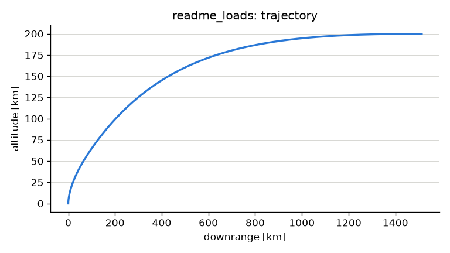 | 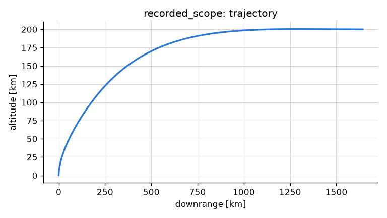 | 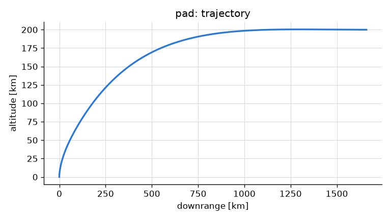 |
| speed | 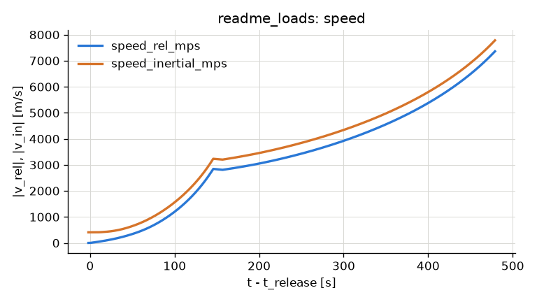 | 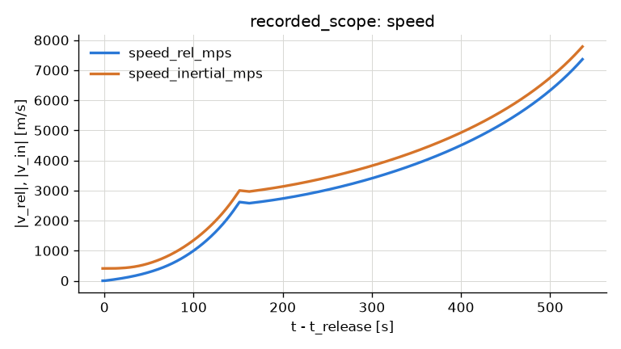 | 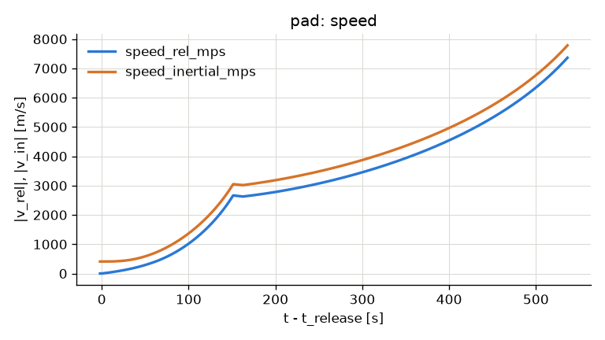 |
| gamma_rel, pitch and psi | 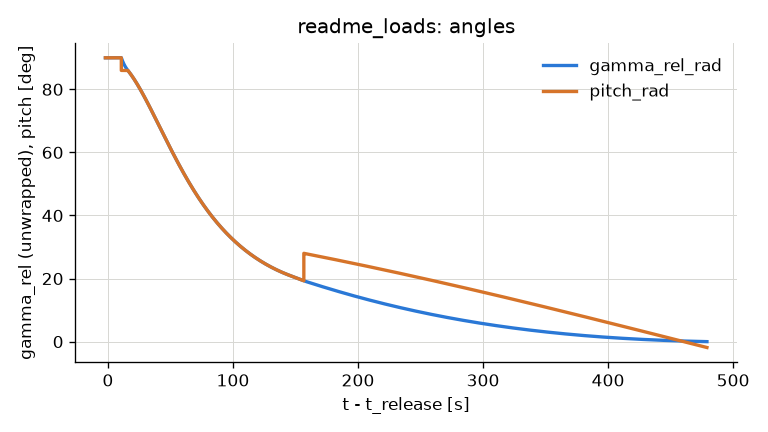 | 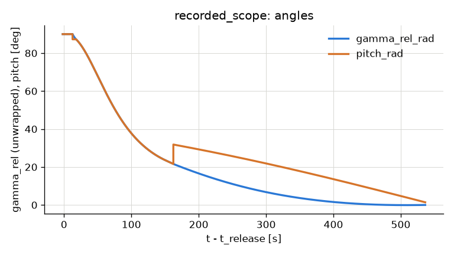 | 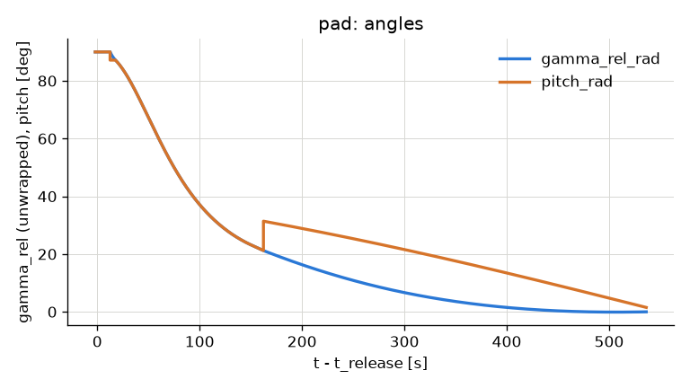 |
| loss integrals | 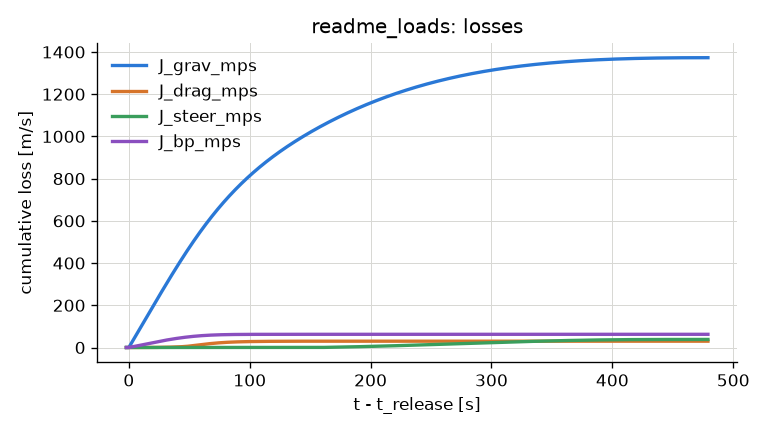 | 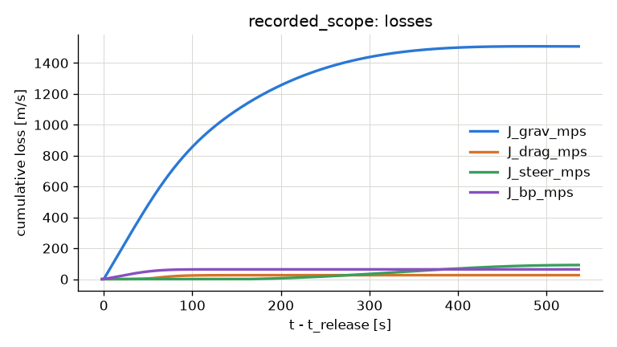 | 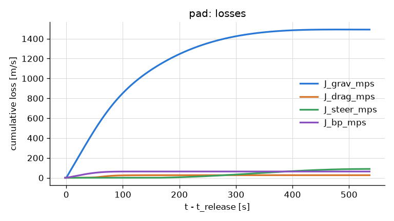 |
| dynamic pressure and Mach; max-Q at the tropopause | 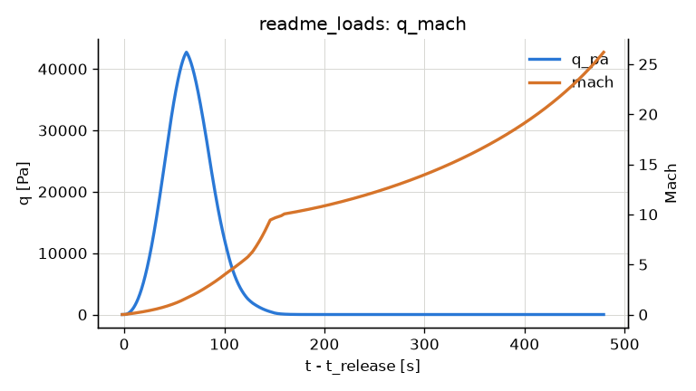 | 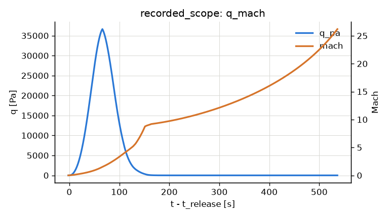 | 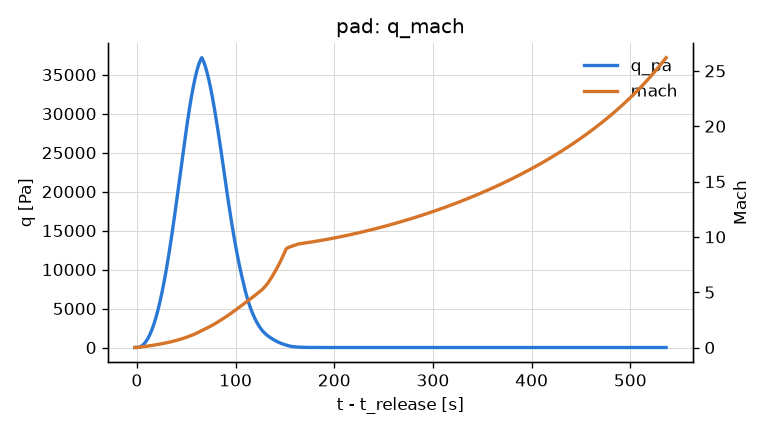 |
| mass and thrust | 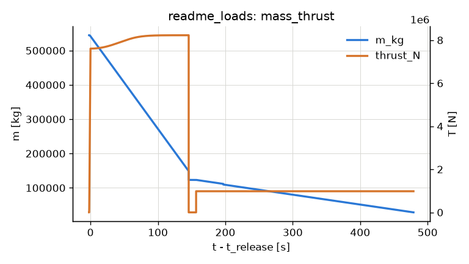 | 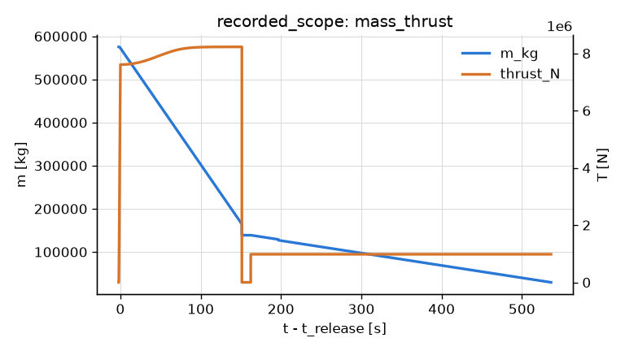 | 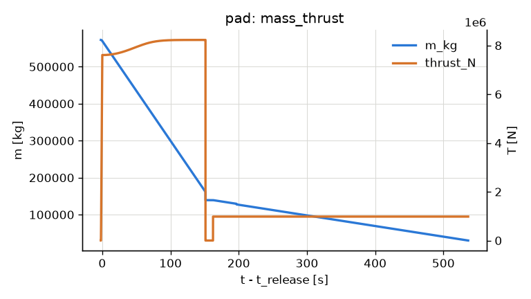 |
| felt axial and lateral g | 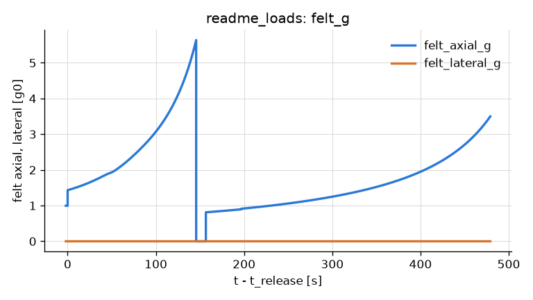 | 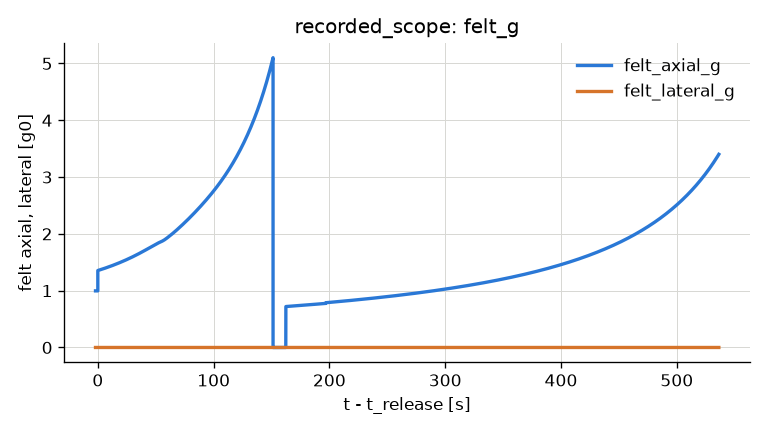 | 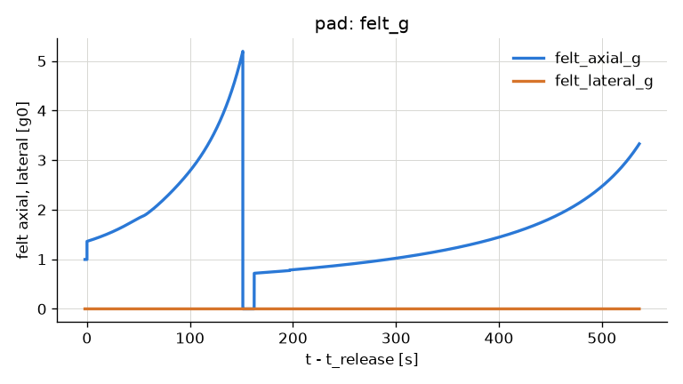 |

No-rotation diagnostic, losses: 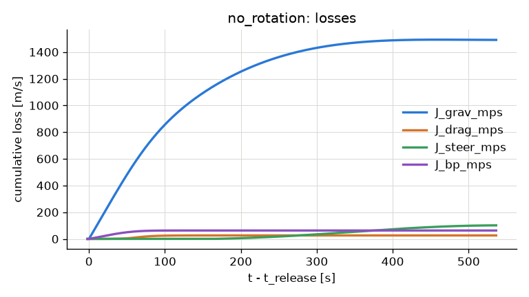

Source: `results/calibration_f9_2d/20260930T100100Z/plots/`. Run: `results/calibration_f9_2d/20260930T100100Z/`; record: `tests/data/calibration_record.json`; regression: `tests/test_calibration.py` (slow; re-runs the three mass sets, P* within 1e-3 relative, no band); git c2849b72e01d.
