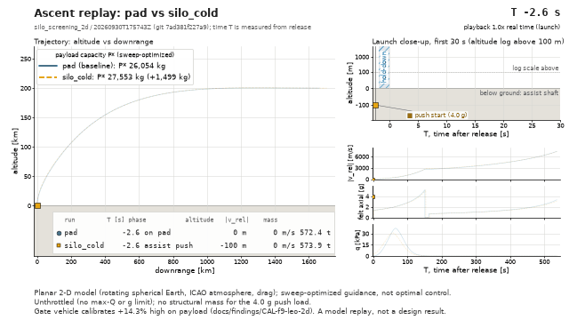

# 2. Quick start

[Manual contents](README.md) · Previous: [1. Install](01-install.md) · Next: [3. Concepts](03-concepts.md)

There is no graphical interface yet (a local app is planned for phase SP2). `launchsim` is
a command-line program: every output is a file. This chapter runs two shipped experiments,
shows where the results go, and turns a 2-D run into an interactive page.

## The shipped experiments

Each file in `experiments/` defines a pad baseline and its variants on one vehicle.

| File | Model | What it runs |
|---|---|---|
| `silo_screening_1d.yaml` | `vertical_1d` | Concept A (the vertical silo) in 1-D: pad, nine variants, three sweeps |
| `silo_screening_2d.yaml` | `planar_2d` | Concept A to orbit: pad, nine variants, three sweeps, sensitivity cases, one bound |
| `silo_bridge_2d_readme.yaml` | `planar_2d` | pad, pad_instant, silo_instant and silo_cold on the README masses |
| `guidance_trigger_2d.yaml` | `planar_2d` | Kick-trigger fairness study (pad and silo_cold, a paired sweep) |
| `calibration_f9_2d.yaml` | `planar_2d` | Calibration against the published Falcon 9 payload (labelled calibration) |
| `silo_offload_2d.yaml` | `planar_2d` | Propellant offload at fixed payload (SP1, pre-registered): pad, three silo variants, eleven offload cases, pad controls, eight sensitivity arms, five sweeps that solve an offload case at every point ([5b](05b-offload.md)) |
| `silo_offload_2d_readme.yaml` | `planar_2d` | The offload headline case repeated on the README masses (the calibration bridge) |

## Step 1: a 1-D run (seconds)

```text
uv run python -m launchsim run experiments/silo_screening_1d.yaml
```

The 1-D model flies straight up to stage-1 burnout, with no air and no Earth rotation. It is
fast: the whole file, with its 16 sensitivity cases, finishes in seconds. The console shows
the results directory and one line per run:

```text
results: <repo>\results\silo_screening_1d\<timestamp>
  pad (baseline): nominal
  pad_instant: nominal
  silo_instant: nominal
  silo_cold: nominal
  silo_cold_lag: nominal
  silo_hot_ramp_on_track: nominal
  silo_hot_full: nominal
  silo_hot_full_impinged: nominal
  silo_failed: impact
  silo_sled_22t: nominal
  sensitivity: 16 cases
```

`nominal` means the run completed; `impact` is expected for `silo_failed`, whose engines
never light (it falls back). Statuses are listed in [9. Reading results](09-reading-results.md#run-statuses).

## Step 2: open the summary

Every run writes a new directory `results/<experiment>/<UTC timestamp>/`; nothing is ever
overwritten. Start with `summary.md` in it. Its header gives the git hash and the
comparison basis; its first table compares every variant with the pad; then come the
sensitivity cases, flags, assumptions and checks. [8. Outputs](08-outputs.md) describes
every file.

## Step 3: a 2-D run to orbit (minutes)

The 2-D model flies to a 200 km circular orbit and searches for each run's payload
capacity, so it is much slower. To run only the pad and the reference cold-start silo,
without the sensitivity cases:

```text
uv run python -m launchsim run experiments/silo_screening_2d.yaml --variant silo_cold --no-sensitivity
```

Expect a few minutes. Besides the two runs, the file's `aero_bound` re-runs silo_cold and
the pad with a larger drag area (a bound runs whenever the variants it names run). The
console line of a 2-D run adds the payload capacity P\*, the flight-path angle at stage-1
burnout gamma\* and the maximum dynamic pressure:

```text
results: <repo>\results\silo_screening_2d\<timestamp>
  pad (baseline): inserted (P* 26054.4 kg, gamma* 22.9891 deg, max-Q 37191.4 Pa)
  silo_cold: inserted (P* 27553.2 kg, gamma* 21.6465 deg, max-Q 31237.6 Pa)
```

These are the same numbers as the shipped record `results/silo_screening_2d/20260930T175743Z`.
The silo run carries 1,498.8 kg more to orbit than the pad. Read that with its caveats
(the full list is in the README's [Results so far](../../README.md#results-so-far)):

- no structural mass is charged for the 4 g push on the full stack, and about 8.1 t of
  stage-1 strengthening would cancel the whole gain;
- the vehicle calibrates +14.3% high against the published Falcon 9 payload (an accepted,
  documented miss);
- guidance is sweep-optimized, not optimal-control, and nothing is throttled;
- the drive imposes a prescribed acceleration, with a massless carriage and no air drag in
  the shaft;
- the model is a planar point mass.

## Step 4: replay it in a browser

```text
uv run python -m launchsim replay results/silo_screening_2d/<timestamp> --runs pad silo_cold
```

This writes one self-contained HTML file, `./silo_screening_2d_<timestamp>_replay.html`,
in the current directory (never inside `results/`). Open it in a browser: play, pause and
scrub the flight, switch runs on and off, and read live telemetry, strip charts and each
run's payload beside the caveats. Nothing is re-simulated in the page; it replays the
recorded time series.

## Step 5 (optional): an animation

```text
uv run python -m launchsim animate results/silo_screening_2d/<timestamp> --runs pad silo_cold --out pad_vs_silo.gif --fps 12 --width 640
```

The extension picks the format: `.gif` through Pillow, `.mp4` through ffmpeg. The capture in
`docs/media/` was made this way from the shipped run:



*The pad baseline and the cold-start silo (3 g net over 100 m, released at 76.7 m/s,
engines lit 0.5 s later with a 2 s ramp), both flown to a 200 km orbit, replayed from the
recorded time series of `results/silo_screening_2d/20260930T175743Z`. Point-mass planar
model, sweep-optimized and unthrottled, on the gate vehicle that calibrates +14.3% high, with
no structural mass charged for the 4 g push.*

## Step 6 (optional, long): the offload experiment

```text
uv run python -m launchsim run experiments/silo_offload_2d.yaml --variant silo_cold --no-sensitivity
```

This flies the pad, silo_cold and the offload cases built on silo_cold, and adds the section
"Propellant saved at fixed payload" to the summary: how much stage-1 propellant the silo
lets the vehicle leave out at the pad's payload. Every case runs nested payload searches, so
expect a long run (the full pre-registered `run` of this file took 14.1 min). What the
options do is in [5b](05b-offload.md#skipping-parts-of-it); how to read the result, with
the caveats that must travel with it, in
[9. Reading results](09-reading-results.md#reading-an-offload-result).

## On a fresh clone

Only each run's top-level `summary.md` is tracked in git; the CSVs and plots are not. To
replay or animate a run, run the experiment first and point the command at the new
timestamped directory.

## Where to go next

- What the runs are and what "payload capacity" means: [3. Concepts](03-concepts.md).
- How to change the silo, the ignition or the sweeps: [4. Experiment files](04-experiments.md)
  and [5. Assist and ignition](05-assist-and-ignition.md).
- Every flag of every command: [7. Commands](07-commands.md).
