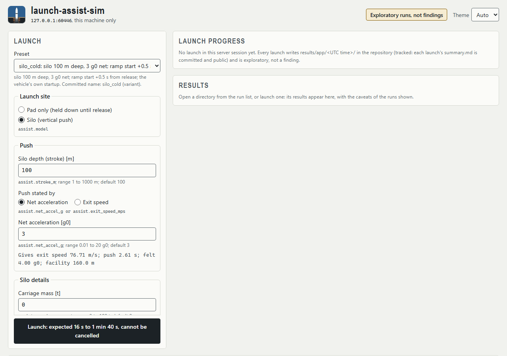
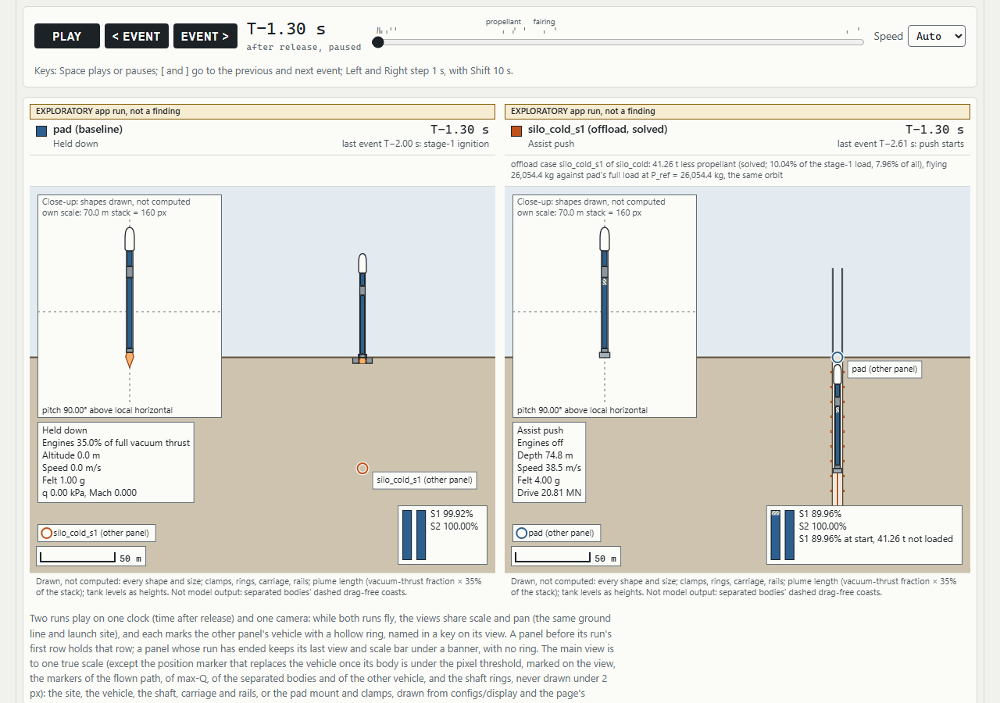

# 7b. The local app and the launch scene

[Manual contents](README.md) · Previous: [7. Commands](07-commands.md) · Next: [8. Outputs](08-outputs.md)

`launchsim app` serves a small web page on this machine: a launch form built from the
committed experiments, a Launch button, a results panel, a browser over the results
directories on disk, and the 2-D launch scene, which draws the pad and the silo side by
side from a run's recorded time series. `launchsim scene` writes that scene as a standalone
page without the app. This chapter describes both as SP2 delivered them
(docs/phases/SP2-launch-app-2d-scene.md; the recorded demo, with screenshots of every step
in both themes, is [docs/demos/SP2/](../demos/SP2/README.md)).

## What it is, and what it is not

- **A local tool.** The server binds `127.0.0.1` only and the page is for this machine;
  nothing it does leaves the machine (below, "Security notes").
- **Every run launched from it is exploratory, never a finding.** A launch is built from
  the form, not from a committed experiment file, and is not pre-registered. Its directory
  goes under `results/app/<UTC timestamp>/`, carries the label `exploratory` and a banner
  that says so, and every replay, animation, scene and video frame of it carries one
  exploratory line. Findings come only from committed experiment files run from a clean
  tree and live in [docs/findings/](../findings/README.md). A launch that equals a committed
  variant or offload case says so on the page ("a reproduction, not new evidence").
- **The numbers it shows beside recorded directories are the findings' numbers**, with the
  caveats those notes carry: the gate vehicle calibrates +14.3% high, no structural mass is
  charged for the push, guidance is sweep-optimized and unthrottled, the drive is a
  prescribed acceleration in a vented shaft. The results panel prints them beside every
  number ([9. Reading results](09-reading-results.md#the-caveats-and-why-each-matters)).
- **The scene replays, it does not simulate.** The vehicle's path, thrust, mass and (while
  the engines run) attitude come from `timeseries.csv` and `events.csv`. Everything else it
  draws is a display-only reconstruction, named as such on the page (below, "What the scene
  draws that the model does not compute").

## Starting it

```text
uv run python -m launchsim app [--port N] [--results-root PATH] [--open]
```

| Option | Default | Meaning |
|---|---|---|
| `--port N` | 8765 | The port on 127.0.0.1. `0` picks a free one. A busy port is one `error:` line and exit 1, never another port |
| `--results-root PATH` | `<repo root>/results` | The results tree the app lists and launches into (`<PATH>/app/<timestamp>/`). Reviews and test launches use a scratch folder here, so nothing they write is committed ([the exploratory regime](#the-exploratory-regime)) |
| `--open` | off | Open the page in a new browser tab |

The app needs a checkout of the repository: the nearest one above the working directory,
else the one that holds the installed package (an editable install, `uv sync`), which is how
the recorded demo started it from a scratch folder so that its MP4 landed there. It reads
`experiments/silo_offload_2d.yaml`, `experiments/silo_screening_2d.yaml`, the vehicle file
they name and `configs/display/` from that checkout; without one (a wheel installed outside
any checkout) it stops with one line that names the file it could not find. It prints its
start lines and then serves until you stop it:

```text
launchsim app: http://127.0.0.1:8765/   (this machine only)
  results root: <repo>\results
  code: git <hash> (clean) as of server start; a launch is refused after a code change: restart the app
  launches are exploratory, not findings
  Ctrl+C stops the server; a running launch is stopped and marked FAILED
  video: ffmpeg <absolute path>; MP4 files go to <the folder you started it from>
```

(From the recorded demo, docs/demos/SP2/README.md, "The server"; the hash and paths are
yours.) Without ffmpeg the last line reads `video: MP4 export off (<why>)` and the page's
Save-video control is disabled; everything else works. The code line matters: the app reads
the experiments as committed at that HEAD, and a launch is refused after a commit that
changes `src/`, `configs/`, `experiments/`, `pyproject.toml` or `uv.lock` (restart the
app); committing documents or app summaries does not force a restart.

**Stopping it.** Press Ctrl+C in the console. The app prints
`launchsim app: stopping; a launch that is writing gets up to 10 s to finish (further Ctrl+C is ignored)`,
marks a running launch FAILED (its directory gets `FAILED.txt`), closes the port and prints
`launchsim app: stopped` (with the marked directory's path when there was one); the exit
code is 0. Ctrl+Break on Windows stops the server the same way, but under `uv run` the `uv`
wrapper then exits with a console-interrupt code (3221225786), so the shell reports a
failure and its prompt may return before the server has finished (TODO.md KI-037). Ctrl+C
is the documented way to stop it.

A launch **cannot be cancelled** from the page; stopping the server is the only way, and it
marks the launch FAILED.

## The page

The header names the address (`127.0.0.1:<port>, this machine only`), carries the badge
"Exploratory runs, not findings" and a Theme select (Auto, Light, Dark; the scene follows
it). Below it: the Launch card, the Launch progress and Results cards beside it, the Scene
card with the Save-video control, Runs on disk, and "SP1's headline, for reference" (the
one finding the offload presets come from, folded, with its six caveat groups).



*The first open, with the silo_cold preset
(`docs/demos/SP2/shots/01-first-open-silo-cold-preset-light.png`). Exploratory: a screenshot
of the app from the recorded demo; what it shows is the form, not a result.*

### The form, group by group

Each field shows a plain label, its unit in brackets, the config key it fills in small
type, its range and its default. The server is the judge: every change is sent as a check
(a dry run) and the page shows what the server answered. Values are in the config's units
(m, s, t, g0, m/s; `g0` = 9.80665 m/s^2, [12](12-faq-glossary.md#glossary)).

| Group | Field (unit) | Config key | What it does |
|---|---|---|---|
| Preset | Preset | - | One of the 17 presets below. The form is filled from the preset's committed fragment; an edited form says "Edited from `<preset>` (`<fields>`)" and offers a reset |
| Launch site | Pad only (held down until release) / Silo (vertical push) | `assist.model` (`none` / `constant_accel`) | Pad only disables the Push and Silo details groups, the push-relative ramp starts, the offload and the penalty, each with its reason shown |
| Push | Silo depth (stroke) [m], 1 to 1000 | `assist.stroke_m` | The stroke L. The derived line under the group gives the exit speed or net acceleration (whichever was not typed), the push time, the felt g and the facility length |
| Push | Push stated by: Net acceleration / Exit speed | `assist.net_accel_g` or `assist.exit_speed_mps` | One of the two ([5](05-assist-and-ignition.md#stating-the-push-two-ways)). Both are checked together: a typed acceleration must give an exit speed inside 1 to 500 m/s, a typed exit speed an acceleration inside 0.01 to 20 g0 |
| Push | Net acceleration [g0], 0.01 to 20 | `assist.net_accel_g` | The net acceleration along the track |
| Push | Exit speed [m/s], 1 to 500 | `assist.exit_speed_mps` | The speed at the mouth |
| Silo details | Carriage mass [t], 0 to 100 | `assist.carriage_mass_t` | The carriage pushed with the rocket (silo_sled_22t: 22 t) |
| Silo details | Exhaust impingement fraction, 0 to 1 | `assist.exhaust_impingement_fraction` | The share of the exhaust momentum that pushes on the carriage while stage 1 is lit on the track. Under the prescribed drive the carriage mass and the fraction change only the drive's force, energy and peak power, not the release speed, the payload or the offload; the group says so |
| Silo details (read-only) | Carriage brake 5 g0, drive efficiency 0.5, shaft vented, track angle 90 deg with exit altitude 0 m | `assist.brake_decel_g`, `assist.drive_efficiency`, `assist.shaft`, `assist.track` | The committed silo's details the form does not edit (from `silo_cold` of `experiments/silo_offload_2d.yaml`) |
| Stage-1 ramp start | Ramp start stated by: Time from release / Time from push start / Depth below the mouth / Speed on the push / Height above the mouth (altitude event) / Height above the mouth (closed form) | `ignition.stage1` (`t_ign_s` with `reference`, `at_depth_m`, `at_speed_mps`, `at_height_m` with `height_method`) | The five ways of [5](05-assist-and-ignition.md#ramp-start-by-depth-speed-or-height). On a pad only the time from release applies. The derived line restates the start four ways (time after release, time from push start, depth and speed on the push, or height and speed on the drag-free coast); a height within 5 m or 1% of the drag-free apex gets a caution |
| Stage-1 ramp start | Ramp start time [s], -10 to 60 | `ignition.stage1.t_ign_s` | Negative lights stage 1 before release (on the track, or on the pad's hold-down) |
| Stage-1 ramp start | Ramp start depth below the mouth [m], 0 to 1000 | `ignition.stage1.at_depth_m` | Refused deeper than the stroke |
| Stage-1 ramp start | Ramp start speed on the push [m/s], 0 to 500 | `ignition.stage1.at_speed_mps` | Refused above the exit speed |
| Stage-1 ramp start | Ramp start height above the mouth [m], 0 to 10000 | `ignition.stage1.at_height_m` | Refused at or above the drag-free apex |
| Stage-1 startup | The vehicle's own startup / Step (instant: a yardstick, not an engine) / Linear ramp / First-order lag | `ignition.stage1.startup` | The vehicle file's shape (a 2 s ramp on the Falcon 9-class files), or an override |
| Stage-1 startup | Startup ramp time [s], 0.001 to 20 | `ignition.stage1.startup.t_ramp_s` | With Linear ramp |
| Stage-1 startup | Startup lag time constant [s], 0.5 to 20 | `ignition.stage1.startup.tau_s` | With First-order lag. A lag slows every run that flies it (the integrator caps its step for the whole lag-lit burn), so the expected duration grows by 1 + 1 s / tau |
| Failed ignition | Stage 1 never lights (the run ends in an impact) | `ignition.stage1.fails`, `end: impact` | The fall-back of [5](05-assist-and-ignition.md#failed-ignition-fails-true). It disables the offload (the run never reaches orbit); the ramp start and startup are still sent and recorded |
| Propellant | Full load / Imposed offload / Solve the largest offload | `offload.cases[]` (`fixed` or `solve`) | Full load writes no offload block. The other two write one case built on the silo variant, with the committed `energy` inputs ([5b](05b-offload.md)). A pad-only launch has no offload (the pad's own offload is its pad control) |
| Propellant | Imposed offload stated as: `stage1_t` / `stage1_fraction` (under Advanced also `stage2_t`, `stage2_fraction`, `both_fraction`); Imposed offload [t or fraction], 0 to 1000 | `offload.cases[].fixed.<key>` | An imposed offload is labelled "imposed", never "saved"; a fraction must lie in (0, 1) and a mass below the stage's load |
| Propellant | Offload solved along: `stage1` (under Advanced also `stage2`, `both`) | `offload.cases[].solve` | A solve locks the Pad control on (every solve runs its pad control, stage 1 included). A stage-2 or both-stage solve is quoted net of its pad control, a property of the vehicle model, not of the assist; the form says so |
| Propellant | Advanced: stage-2 and both-stage offloads | - | Unlocks the stage-2 and both-stage forms, each with its reading |
| Stage-2 pre-offload | Stage-2 pre-offload (0: none) [t], 0 to 1000 | `offload.cases[].stage2_offload_t` | Propellant taken from stage 2 before a stage-1 case. Disabled with Full load |
| Paired pad | Paired pad | `offload.cases[].paired_pad` | Also fly the pad with the same propellant change and no push. Disabled with Full load; cleared by a penalty (the two are refused together) |
| Assumed structural penalty | Assumed structural penalty, stage-1 dry mass added (0: none) [t], 0 to 100 | `offload.cases[].stage1_dry_mass_added_t` | An assumed stage-1 dry mass on the assisted run: a penalty row, not a sized structure. Disabled with Full load and with Pad only |

Every disabled group prints why it is disabled. The form sends only the fields its choices
use; the request carries no run, case or experiment name, and the server builds the
experiment from the committed files it loaded at start (the shared blocks, the baseline and
the vehicle can never come from the page).

### The presets

Each preset is a committed name: the baseline, a variant of `experiments/silo_offload_2d.yaml`
or `experiments/silo_screening_2d.yaml`, or a case of the offload block; its fields are read
from the committed fragment, so an untouched preset launched as it is reproduces that name's
configuration. The expected duration is the range the page shows with the pad not cached
(the first launch of a server session; later launches reuse the pad baseline and drop its 8
to 50 s). The ranges are estimates from run times measured on the author's machine during
development, the upper ends widened from runs under load; the page prints the same note.
They are not promises.

| Preset (the page's order) | What it names | What it launches | Expected duration, pad not cached |
|---|---|---|---|
| `pad` | the baseline | The pad alone, held down until release | 8 s to 50 s |
| `silo_cold` | variant | Silo 100 m deep, 3 g0 net; ramp start +0.5 s from release; the vehicle's own 2 s ramp. The page opens on it | 16 s to 1 min 40 s |
| `silo_hot_ramp_on_track` | variant | The same silo, lit 2 s before release (the ramp ends at release) | 16 s to 1 min 40 s |
| `silo_cold_200m` | variant | Silo 200 m deep at silo_cold's exit speed (76.7072 m/s, the full double) | 16 s to 1 min 40 s |
| `silo_cold_s1` | offload case | silo_cold with the largest stage-1 offload solved, the pad control and the paired pad: SP1's headline case | 57 s to 6 min 10 s |
| `silo_cold_fix5pct` | offload case | silo_cold with 5% of its stage-1 load imposed | 24 s to 2 min 30 s |
| `silo_cold_fix10pct` | offload case | silo_cold with 10% of its stage-1 load imposed | 24 s to 2 min 30 s |
| `silo_cold_s1_dry+2t` | offload case | The stage-1 solve with an assumed +2 t of stage-1 dry mass | 49 s to 5 min 20 s |
| `silo_cold_s1_dry+4t` | offload case | The same with +4 t | 49 s to 5 min 20 s |
| `silo_cold_s1_dry+8.1t` | offload case | The same with +8.1 t (RQ1's break-even row) | 49 s to 5 min 20 s |
| `silo_cold_lag` | variant | silo_cold with a first-order lag startup, tau 1 s | 24 s to 2 min 30 s |
| `silo_hot_full` | variant | Full thrust for the whole push (lit 2 s before the push starts) | 16 s to 1 min 40 s |
| `silo_hot_full_impinged` | variant | The same with the exhaust impingement fraction 1 | 16 s to 1 min 40 s |
| `silo_sled_22t` | variant | silo_cold with a 22 t carriage | 16 s to 1 min 40 s |
| `silo_failed` | variant | The push with stage 1 never lighting: the fall-back and the impact | 9 s to 55 s |
| `silo_instant` | variant | Instant full thrust at release (a yardstick, not an engine) | 16 s to 1 min 40 s |
| `pad_instant` | variant | The pad with instant full thrust at release (a yardstick) | 16 s to 1 min 40 s |

(The names and ranges were read from the app's own preset table at commit `705025f`,
2026-10-07; the ranges come from `src/launchsim/appform.py`, where each piece of a launch
has a measured range: 8 to 50 s for a searched run, 25 to 160 s for a solve with its
verification, 8 to 60 s for a stage-1 pad control, 0.5 to 5 s for a run without a search.)
Under "Derived values" a preset launched unchanged says that it reproduces the committed
name and offers to open SP1's recorded run of that case instead of launching.

### The checks and the refusals

Every change of the form is sent to the server as a dry run (`POST /api/launches` with
`dry_run: true`): nothing is flown and nothing is written. The answer fills "Derived values
(checked by the server, nothing flown)": the run names the launch would write, the push
numbers, the ramp start four ways, the expected duration with its note. A refusal is one
line under the field it names, the field is marked, and Launch is disabled with
"The server refused this form (see the marked field)." Refusals that work this way, each
writing nothing: a push stated both ways; a ramp start stated two ways; a depth deeper than
the stroke (`at_depth_m 150 m is deeper than the track (stroke_m 100 m)` in the demo); a
speed above the exit speed; a height at or above the drag-free apex; a push-relative ramp
start, an offload or a penalty on a pad-only launch; an offload with a failed ignition; a
stage-2 or both-stage form without Advanced; an imposed mass at or beyond the stage's load,
or a fraction outside (0, 1); a paired pad with a penalty; a number outside its range, not
finite, not a number (`true`, `"3"`), or an integer too large for the form. The server
also refuses a request with a key the form does not know, without repeating it.


*The results panel after the silo_cold_s1 preset
(`docs/demos/SP2/shots/03-solve-done-panel-light.png`). Exploratory: an app run from the
recorded demo, which reproduces SP1's figure and is not new evidence; the caveats are in the
panel's "Read before quoting" block below what is shown.*

### Launch

The button reads `Launch: expected <range>, cannot be cancelled`. When the upper end of the
range passes a minute, or the same configuration was launched before in this session, a
confirmation asks first ("This launch is expected to take ... (an estimate). It cannot be
cancelled (stopping the server marks it FAILED). Launch it?", with "Launch it" and "Not now";
"Not now" takes the focus, so one Space never confirms). One launch runs at a time: while
one runs the button says so ("A launch is running: one at a time, and it cannot be
cancelled. The form, the run list and the scene stay usable."), and a second request is
answered 409. A launch after a code change is refused: restart the app. The page acts on
nothing until you have used it (a page opened from a link on another site reads no preset
from its address and sends nothing before your first click).

### Launch progress

The job card lists the five stages the app owns, each with its state (NOW, DONE), its time
so far and its expected range, and "longer than expected" past it:

1. **Preflight**: the form is resolved and checked, the git record taken, the directory made.
2. **Pad baseline**: the pad flown, or "Pad baseline, cached" when a launch of this server
   session already flew it (the cache key is the baseline's run dict, the vehicle and the
   server-start git state; the pad controls and a paired pad are never cached).
3. **Variant**: the silo (or pad) variant with its payload search.
4. **Comparison and offload**: the comparison with the pad; with an offload, the pad
   control, the solve with its verification, and the paired pad.
5. **Writing the results**.

Then "took N s", the directory's name, the outcome and its headline: "Complete";
"Complete, flagged" (the flags above the numbers; a failed verification reads "flagged
lower bound"); "Complete, not in orbit: `<run>` did not reach the target orbit: impact" (a
failed ignition; "short of orbit" likewise); "Complete: the run did not fly" with the kind
(a failed search or guidance, for example a height-by-event ramp start just under the
drag-free apex, `no_ignition`; the pad alone is shown); "Complete: the offload found
nothing", with the pad control's verdict; "Crashed (FAILED.txt)", with its last line and no
scene; "Refused"; and the tag "Exploratory app run: not a finding". At
completion the new scene opens by itself, unless you had touched the player meanwhile, in
which case a button offers it ("Show the new launch").

### The results panel

Built from the directory shown, so a recorded directory opened from the run list gets the
same panel as a fresh launch. In order:

- the tag: "Exploratory app run: not a finding: app/`<timestamp>`", or the recorded directory
  with its git state;
- "Launched:" the launch in words (the form's description); "Code at server start" with both
  git states (the commit imported at server start and the working tree at launch) and the
  recorded commit; "Run shown: `<right>` beside `<left>`";
- the headline for the launch kind: the payload capacity and its gain against the pad ("an
  upper bound: unthrottled and unconstrained"); "Propellant removed at the pad's payload
  (P_ref = ...)" with the tonnes and the shares of the stage-1 and total loads for a solve;
  an imposed offload's P\* - P_ref with its reading (positive: the run carries more than the
  pad, so the offload is not the largest possible; negative: a payload loss); what is left
  of the offload with a penalty; "did not reach orbit" with no payload line;
- "SP1's headline", folded, when the launch reproduces SP1's case: "This launch reproduces
  only its silo_cold_s1 figure (x\* 41.26 t): a reproduction, not new evidence. The penalty
  rows, the +/-10% range, the screening ratio and the README-loads bridge come from SP1's
  runs, not from this launch", with the note's text and its six caveat groups;
- "Reproduction": each committed name the launch kept, with the commit; or "Against SP1's
  silo_cold_s1: n settings differ from it, so this figure is not SP1's headline", with the
  list of what differs (compared by config key);
- "Offload runs of this launch": the pad control with its verdict, the case, the paired pad
  with its payload and shortfall against P_ref;
- the push: the silo in words, the drive note, push time, felt g on the track, interface
  force, electrical energy, peak drive power, braking distance, facility length;
- the flight: status, the stage-1 ignition in words, max-Q "above the pad's" or "below the
  pad's" from the run's own metrics, liftoff mass, MECO after release, peak q-alpha, peak
  felt axial g in flight, the payload flown;
- the flags and the verification (a failed verification reads "flagged lower bound");
- "Read before quoting: the caveats of the runs shown", built from the runs shown: the
  exploratory line, the planar model and sweep-optimized guidance, the +14.3% calibration
  miss, no structural mass for the run's own push load ("silo_cold_s1 (531.1 t at push
  start, 41.26 t less propellant) feels up to 4.0 g during the push" in the demo), the
  prescribed drive, the reading of the offload block, the directory's recorded offload
  caveats word for word, and the display-only items of the scene, folded.

A stage-2 or both-stage solve is shown net of its pad control as a property of the vehicle
model; an imposed stage-2 or both-stage offload says that it is not netted (it has no pad
control). An imposed offload is never called "saved".

### Runs on disk

The run browser lists the results root in two groups, newest first: "App runs
(exploratory)" (`results/app/`) and "Recorded experiments" (everything else). Each row
gives a one-line description of the directory, `<experiment>/<timestamp>`, its state, its
size, its git hash and state (and for an app run the server-start state), its age, and the
findings notes it is cited in; a playable row has an Open button, the others say why there
is no scene. "Playable only" (on by default) hides the rows without a scene; "Refresh the
list" re-reads the root (the list stays usable while a launch runs, and the running launch
is listed with "running: no scene yet").

| State or reason | Meaning | Playable |
|---|---|---|
| complete | A `run` directory with `summary.md` and a planar time series | yes |
| calibration | A calibration directory (labelled so); its cases are listed as runs | yes |
| running | The launch in progress | not yet |
| failed | `FAILED.txt` is present (its first line is shown) | no |
| incomplete | Neither `summary.md` nor `FAILED.txt`: a process stopped mid-write | no |
| unreadable | No readable `metrics.json`, or a linked entry (links are skipped) | no |
| sweep | A sweep directory: no top-level `metrics.json` ([8](08-outputs.md#a-sweep-directory)) | no |
| 1-D | A `vertical_1d` directory: no downrange or flight-path angle to draw | no |
| no run holds a time series (none flew) | A planar directory whose runs all failed their search | no |

The server never writes into or deletes a directory it did not create.

## The scene

The Scene card holds two pickers (Left panel, Right panel), the notes of the runs shown, an
"Open as a page" link (the same page in its own tab) and the framed scene. The default
pair of any directory is the baseline on the left and, on the right, the first solved
stage-1 offload case, else the first assisted variant that is not a yardstick, else nothing
(one full-width panel). Any run of the directory can be picked, offload runs, bound re-runs
and calibration cases included; a run that did not fly has no scene.



*The scene card after the silo_cold_s1 preset, at T-1.30 s
(`docs/demos/SP2/shots/03-solve-done-tank-part-full-light.png`). Exploratory: an app run from
the recorded demo. The banner at the top of each panel is the exploratory mark every app run
carries.*

**What it draws.** Two panels on one clock (time after release) and one camera. Each panel
has a true-scale view of the site (the shaft with its rings and carriage, or the pad's mount
and clamps; the ground; the sky), the rocket drawn to scale while its body is at least 3 px
wide and after that a position marker with a heading tick on the flown path, the recorded
events marked on the path (max-Q among them), a hollow ring where the other panel's vehicle
is, a scale bar, a HUD (phase, engines as a share of full vacuum thrust, altitude, speed,
felt g, q and Mach; on the track the depth, speed, felt g and drive force) and a tank gauge
per stage (an offloaded tank starts part-full with the never-loaded band hatched and says
"S1 89.96% at start, 41.26 t not loaded" for SP1's case). Beside the view a **close-up** at
its own fixed scale ("own scale: 70.0 m stack = 160 px") shows the vehicle with its attitude,
plume and tank levels; at staging it frames stage 2 with the spent stage falling away and
says "Gap drawn, not computed"; at the fairing drop it shows the halves opening, then
leaving. The camera zooms out as the flight grows and never zooms back in. Under each view
a caption repeats what is drawn and not computed, and under both panels the event list, the
separated bodies with their computed impact times, the directory's data line (git state
included) and the "Read before quoting" caveats.

**Playback.** Play pauses and resumes; `< Event` and `Event >` jump between recorded events;
the scrubber carries ticks at the events and the clock reads `T-2.61 s after release,
paused` or `playing at 1.00x`. The Speed select offers Auto, 0.25, 0.5, 1, 5, 20 and 60.
Auto is the scene's own rate law: 0.5x through the push and the startup ramp, 1x through
the kick, then rising smoothly toward 30x, held at 3x from just before MECO to just after
stage-2 ignition and around cutoff, 2x around each fairing drop and 5x near each run's
max-Q, so that the separations stay on screen for at least 1.5 wall seconds. Keys, from
anywhere on the app page outside a form control while the scene is on screen (and on the
standalone page): Space plays or pauses; `[` and `]` go to the previous and next event; Left
and Right step the clock 1 s, with Shift 10 s. A run that ends keeps its last view under
"Ended T+536.30 s: in orbit" (or ": impact"); the other panel plays on.

**Themes.** The page follows the system's light or dark scheme; the app's Theme select sets
it for the framed scene, and the standalone page takes `#theme=light` or `#theme=dark` in
its address. Both themes meet the contrast the phase asked for (shapes 3:1, text 4.5:1),
and the demo's screenshots are in both.

### What the scene draws that the model does not compute

The page lists these under its caveats, word for word from the scene builder
(`src/launchsim/scene.py`, `DISPLAY_ONLY`), and every exported frame carries the footer
"The vehicle's path, thrust and mass are replayed from the recorded time series. The spent
stage, fairing halves, carriage after release and unpowered attitude are display-only
reconstructions and are not model output." In short ([docs/physics.md](../physics.md),
"Display-only reconstructions"):

- every shape and length: the model has a reference area and a point mass; the shapes come
  from `configs/display/` ([6](06-vehicles.md#display-files-configsdisplay)) and the page's
  drawing constants; `alt_m` is drawn at the rocket's base;
- the body attitude: the model has a thrust direction, not a body axis; while the engines
  are off outside the hold and the track, the drawn attitude is held at the last angle the
  model defines; the instant steps at the kick and at stage-2 ignition are the model's;
- the spent stage and the fairing halves: a drag-free two-body coast from the recorded
  separation state, with each body's own computed impact time, speed and downrange (no
  re-entry drag, so not a landing prediction); the gap drawn during the 11 s staging coast
  is a drawing choice (the coast stays within 0.2 m of the recorded rows on the reference
  runs, and each page quotes its own run's gap); both halves follow one path; a body still
  in flight when the run ends is drawn stopped there;
- the plume inside the shaft and the carriage beneath lit engines: the model has a vented
  shaft and one impingement fraction that moves only track forces and drive energy;
- the carriage after release and where it brakes: the model gives a braking distance only;
  a failed ignition falls back along an obstacle-free path (the model has no contact with
  the carriage, the mouth or the shaft; the page says so under a run that ends in an
  impact, and draws the carriage and rails as outlines);
- one propellant level per stage, read empty at depletion (no residual or reserve is
  modelled);
- the pad's liftoff marker and a held ramp's end marker, synthesised from the metrics; the
  marker that replaces the rocket once its body is under 3 px wide is a position only.

## Save video (MP4)

The Save-video control under the scene exports the scene shown as an MP4. It needs ffmpeg,
resolved once at start (the start line names the executable); without it the control says
why it is off. Frame rate: 10, 15, 20, 24 or 30 fps (default 20); width: 960, 1280 or 1920
px, 16:9 (default 1280 x 720). The length line says what the clip will be ("Natural length
86.4 s at 20 fps: 1727 frames of 1280 x 720 px, from the first row to the end."); a clip
over 1,800 frames is scaled to fit and the line says by how much (at 24 fps the default pair
plays 1.15x faster over 75 s). The page captures every frame from the scene and posts it to
the server, which pipes it to ffmpeg; the control shows "Saving frame n of N; elapsed ...,
... ms per frame" and a Cancel button, then "Saved:" with the file's path and "Copy the path".

The file is `<experiment>_<timestamp>_<left>-vs-<right>_scene.mp4` in the server's working
directory (the folder you started the app from), never inside a results tree and never
overwriting (a taken name gets `-2`, `-3`, ... as results directories do); git ignores
`*_scene.mp4`. Every frame carries a
footer: the display-only line above; the data line (the directory and its git state); the
three model lines ("Planar 2-D model (rotating spherical Earth, ICAO atmosphere, drag);
sweep-optimized guidance, not optimal control.", "Unthrottled (no max-Q or g limit); no sized
structural mass for the 4.0 g push load.", "Gate vehicle calibrates +14.3% high on payload
(docs/findings/CAL-f9-leo-2d). A model replay, not a design result."); a penalty row's
assumed dry mass and the run's own structure note; and, for an app run, the exploratory
line. A launch and a video never run together. The demo's export (1,727 frames at 20 fps,
86.35 s, 6.0 MB; docs/demos/SP2/README.md, "The video export") is not in the repository;
the gallery's scene video was made from a recorded directory, not from an app run.

## The exploratory regime

- A launch writes `results/app/<UTC timestamp>/`, a normal results directory
  ([8](08-outputs.md#an-app-launch)): `summary.md`, `metrics.json`, `resolved_config.yaml`
  and one folder per run (the pad, the variant, the offload runs). It writes **no PNG
  plots**: a PNG of an exploratory run would carry no mark, and the scene replaces it.
- `metrics.json` and `resolved_config.yaml` carry `label: exploratory`, and the git record
  holds both states: the commit imported at server start and the working tree at launch;
  the directory reads dirty if either was. `summary.md` opens with the banner "EXPLORATORY
  app run, not a finding. Launched from the local app's form, not from a committed
  experiment file, and not pre-registered. Code: ... Do not cite; findings are in
  docs/findings/. Calibration +14.3%, no structural mass for the push, sweep-optimized,
  unthrottled." and says which names are reproductions.
- `replay`, `animate` and `scene` prepend one exploratory line to the caveats of such a
  directory, and every video frame carries it.
- Each launch's `summary.md` is tracked in git like every other run's (decision D-SP2-03),
  the CSVs and JSON are not. The commit rule of a session (D-SP2-37, docs/process/SESSION_PROTOCOL.md,
  "App runs"): reviews and gates start the app with `--results-root <a scratch folder>`,
  so nothing they launch is committed; only demo launches, made from a clean tree after a
  phase's last code commit, go to `results/app/`, and their summaries go in a commit of their
  own (`SP2 step <k>: app summaries`), never in a tracker commit. Gallery, deck and manual
  material comes only from the recorded experiment directories, never from an app run; the
  site build refuses a scene page written from `results/app/`.
- A launch keeps a committed run or case name only when its resolved configuration equals
  the committed one; otherwise the silo variant is named `silo`, a pad variant
  `pad_variant`, and a case `silo_<tag>` (`silo_s1`, `silo_fix7pct`, ...), so a public
  summary cannot carry SP1's row name with another configuration.

## Security notes

- The server binds `127.0.0.1` (IPv4) and one port, exclusively: a second server on the same
  port fails with one line. Nothing is reachable from another machine.
- Every request is checked before its body is read: the Host must be the app's own, the
  Origin absent or the app's own, Sec-Fetch-Site (when present) same-origin; query strings
  are refused; JSON bodies are capped (64 KiB; a video frame 4 MiB, checked as a PNG of the
  session's size); every response carries a Content-Security-Policy, nosniff, no-store and
  no-referrer headers; the app page cannot be framed, the scene only by the app. A page on
  another loopback port or another host cannot start a launch, post a frame or make the
  server build a scene (the phase's exit criterion 17, checked with raw sockets and a real
  browser). Errors carry no traceback and no local path.
- The page, the scene and an exported page make no request off the machine: no fonts, no
  scripts, no analytics (the scene page's policy allows nothing but its own pinned script).
- **The accepted risk.** There is no login. Any process or user on this machine can reach
  the port, start a launch (which writes a directory under the results root and runs the
  simulator for minutes) or export a video (which writes a file in the working directory).
  Run it on a machine you trust, and stop it when you are done.

## The standalone scene page: `launchsim scene`

```text
uv run python -m launchsim scene <run_dir> [--runs NAME [NAME ...]] [--out PATH] [--display PATH]
```

| Argument | Default | Meaning |
|---|---|---|
| `run_dir` | required | One results directory of a `planar_2d` `run`: `results/<experiment>/<timestamp>` |
| `--runs NAME [NAME ...]` | the baseline and the first solved stage-1 offload case, else the first assisted variant that is not a yardstick | The runs the page's pickers can show, at most four; the first two open side by side. Offload runs, bound re-runs and calibration cases can be named |
| `--out PATH` | `./<experiment>_<timestamp>_scene.html` | The output `.html` file. Refused inside the run's results tree or any folder named `results` (the one rule of `animate`, `replay` and `scene`, [7](07-commands.md#where-the-default-output-goes)) |
| `--display PATH` | `configs/display` of the repository above the working directory, else above the installed package | The folder of the display files ([6](06-vehicles.md#display-files-configsdisplay)) |

The console prints `scene: <path> (<size> KiB)`. The page is the same one the app frames
(the app serves it at `/scene/<experiment>/<timestamp>/<runs>`), self-contained and ASCII,
and it plays from the file with no server: the spent stage's and the fairing halves' coasts
are integrated once by the command, not in the browser, and the page loads nothing. Git
ignores the default name (`*_scene.html`), so a page to keep gets another name, as the
demo's `docs/demos/SP2/pad-vs-silo-cold-scene.html` and the gallery's
`site/examples/pad-vs-silo-offload-scene.html` do. Refused with one line: a missing
directory; one with `FAILED.txt`; a sweep directory; a `vertical_1d` directory; a directory
without `summary.md`; a run that did not fly; more than four runs; an output in a results
tree ([11](11-troubleshooting.md#the-app-and-the-scene)).

The recorded SP1 pair as a scene page and a video, with the commands that made them, is
the gallery's example SP1.3 on the project site
([Animation examples](https://khoks.github.io/RocketLaunchOptimizationSimulator/examples/)).

Next: [8. Outputs](08-outputs.md)
